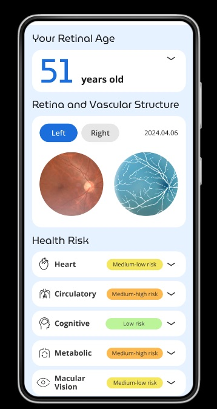
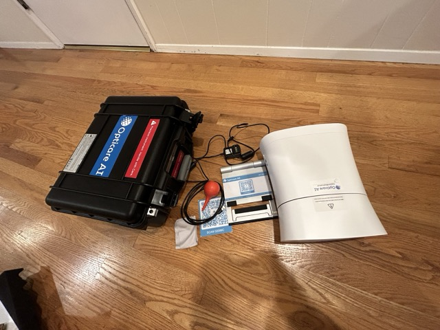
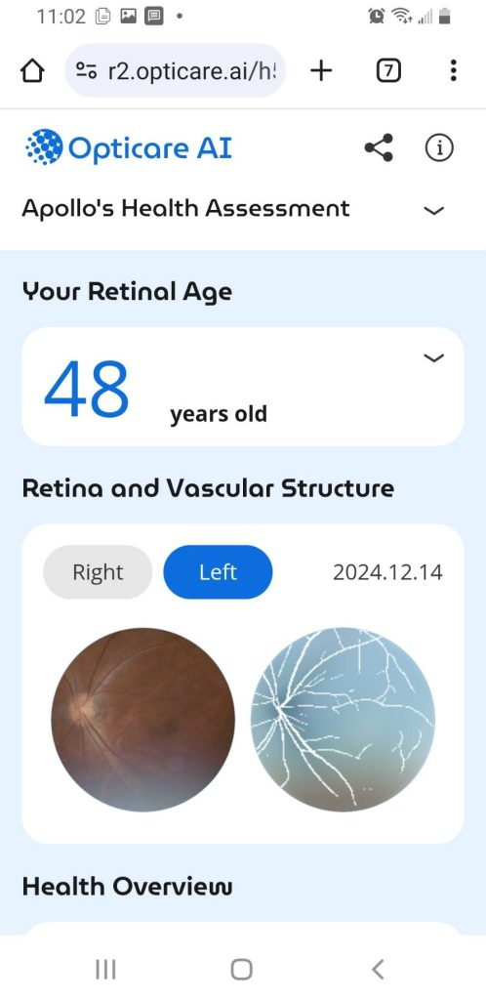

# ch1-proteins.qmd

---
title: "The Building Blocks of Life"
subtitle: "Understanding Proteins and Peptides"
---

## Basic Protein Structure and Function

To understand the proteins that make you, let's begin with some basic chemistry. Proteins represent one of nature's most elegant molecular innovations. These complex macromolecules emerge from a remarkably simple foundation: chains of amino acids linked through peptide bonds. Yet from this basic architecture arises an astounding diversity of biological functions that merit our careful scientific consideration.

Think of amino acids as nature's LEGO blocks. Just as you can build incredible structures from simple plastic pieces, your body builds proteins from these molecular building blocks. There are 20 different types of amino acids that your body uses, each with its own special properties - some love water, some hate it, some carry electrical charges. Each amino acid has the same basic structure: a central carbon atom (think of it as the heart) connected to an amino group (NH2, like a connector on one side), a carboxyl group (COOH, like a connector on the other side), and a unique side chain (R group, like the special feature that makes each amino acid unique).

When these amino acids link together, they form what we call peptide bonds. Imagine snapping LEGO blocks together - that satisfying click? That's like a peptide bond forming between amino acids. The amino group of one amino acid connects to the carboxyl group of another, releasing a water molecule in the process. This is why we call proteins "polypeptides" - they're many ('poly') amino acids linked by peptide bonds.

But here's where it gets absolutely fascinating: these chains don't just stay as straight lines. They fold into incredible three-dimensional shapes, like origami at the molecular level. Scientists describe this folding in four levels of structure:

Primary structure: This is just the sequence of amino acids, like a string of beads. Imagine writing out the letters of the alphabet in order - that's your primary structure.

Secondary structure: The chain starts to fold into regular patterns. The two main patterns are alpha helices (think of a spiral staircase) and beta sheets (think of a pleated paper fan). These shapes form because the amino acids start making hydrogen bonds with each other - like tiny molecular magnets attracting each other.

Tertiary structure: This is where the magic really happens. The whole chain folds up into a complex 3D shape, driven by the properties of those side chains we talked about. Some parts attract water, some repel it. Some carry positive charges, others negative. All these forces work together to create a specific shape that lets the protein do its job.

Quaternary structure: Sometimes, multiple folded protein chains come together to form even larger structures - like how multiple LEGO creations might combine into one massive structure.

Why does all this matter? Because the shape of a protein determines its function. Think about a key fitting into a lock - the shape has to be exactly right. Proteins are the same way. An enzyme (a type of protein that speeds up chemical reactions) has to have exactly the right shape to grab onto its target molecule. A structural protein like collagen has to have the right shape to provide strength to your skin and bones.

And here's the truly mind-blowing part: your body is making and folding proteins constantly, getting the shape right almost every time. Millions of proteins, each with a specific job, all working together to keep you alive and healthy. From the keratin in your hair to the hemoglobin carrying oxygen in your blood, from the antibodies fighting infection to the ion channels in your neurons helping you think - it's all proteins, all shaped exactly right for their jobs.

This is just the beginning of understanding proteins, but already you can see why scientists get so excited about them. They're the molecular machines that make life possible, and understanding them is key to understanding ourselves.

## What Proteins Do

Let's dive into the incredible variety of proteins that make life possible. Just as a city needs different types of workers - construction crews, delivery services, communication specialists - your body needs different types of proteins, each perfectly shaped for its specific job. Let's explore these molecular specialists that keep you alive and thriving.

First, let's talk about structural proteins - the construction crews of your body. These are the proteins that quite literally hold you together. Think of collagen as nature's steel cables. These incredibly strong protein fibers weave through your skin, tendons, and bones, providing strength and flexibility. When you stretch your skin and it bounces back? That's collagen at work. As you age and collagen production decreases, that's why your skin becomes less elastic - the molecular cables are becoming less abundant and less organized.

Keratin is another fascinating structural protein. Imagine building a protective wall, but at the molecular level. That's what keratin does in your skin, hair, and nails. These proteins link together to form incredibly tough barriers that protect you from the environment. The same basic protein creates both your delicate skin cells and your tough fingernails - it's all in how the proteins arrange themselves.

But perhaps the most amazing structural proteins are actin and myosin, the molecular motors that make movement possible. Picture two sets of protein filaments that slide past each other, like two combs moving in opposite directions. When these proteins interact, they create the force that contracts your muscles. Every time you move - from a heartbeat to a smile - you're watching these molecular machines in action.

Now, let's talk about enzymes - the molecular catalysts that make life's chemistry possible. These proteins are like highly specialized factory workers, each designed to perform a specific chemical task. What makes enzymes truly remarkable is their speed and precision. Without enzymes, many of the chemical reactions necessary for life would take years to occur. With enzymes, they happen in milliseconds.

How fast are enzymes? Some can speed up chemical reactions by a factor of 10^17 - that's like taking a process that would normally take a billion years and completing it in seconds. They achieve this through incredibly precise molecular shapes that fit their target molecules (called substrates) like a lock and key. Imagine a molecular machine that can grab a specific molecule, rearrange its atoms, and release the products, all in the blink of an eye. That's an enzyme at work.

Transport proteins are like the delivery services of your cells. Hemoglobin, perhaps the most famous transport protein, is an oxygen carrier with an ingenious design. Each hemoglobin molecule can carry four oxygen molecules, picking them up in your lungs and delivering them throughout your body. The protein changes shape slightly when it binds oxygen, which helps it load and unload its cargo at exactly the right places.

Ion channels are another class of transport proteins that create molecular gateways in cell membranes. These proteins form selective tunnels that only allow specific ions (like sodium or potassium) to pass through. It's like having a security system that only lets certain molecules enter or exit the cell. This selective transport is crucial for everything from your heartbeat to your thoughts - every nerve impulse relies on these molecular gatekeepers.

Finally, let's explore signaling proteins - the communication specialists of your cellular city. These proteins are responsible for detecting and transmitting messages throughout your body. Hormone receptors, for instance, are proteins that sit on cell surfaces, waiting to detect specific hormone molecules. When they catch their target hormone, they change shape, triggering a cascade of effects inside the cell.

G-proteins are particularly fascinating signaling proteins. They act like molecular switches, turning cellular processes on and off in response to signals. When a hormone or other signaling molecule activates them, they change shape and relay the message to other proteins inside the cell. This molecular relay race can trigger responses like releasing energy from stored fat or increasing heart rate.

Transcription factors might be the most powerful signaling proteins of all. These proteins can turn genes on and off, controlling which proteins get made in a cell. They're like molecular orchestra conductors, coordinating which genes are active at any given time. This ability to regulate gene expression is crucial for everything from embryonic development to daily cellular maintenance.

Understanding these protein classes helps us appreciate the incredible molecular choreography happening in every cell of your body. Each protein has evolved to perform its specific task with remarkable precision, and they all work together in an intricate dance that makes life possible. As we continue to unravel the mysteries of protein structure and function, we gain deeper insights into both health and disease, opening new possibilities for maintaining and enhancing human wellbeing.

## How Peptides Work as Signaling Molecules

Now you're ready to understand a very important subset of protein-based molecules: the peptides. Think of peptides as the text messages of your cellular communication system - shorter, faster, and more nimble than full proteins, but carrying vital information that keeps your body running smoothly.

While proteins might contain hundreds or thousands of amino acids, peptides are much shorter chains, typically just 2-50 amino acids long. But don't let their size fool you - these molecular messengers pack an incredible punch. They're like the haiku of the protein world: short, precise, and remarkably powerful in their effects.

Let's explore what makes peptides so special. First, their precision is absolutely remarkable. Consider two peptide hormones, vasopressin and oxytocin. These molecular cousins differ by just two amino acids - that's like changing two letters in a word - yet they have completely different effects in your body. Oxytocin is famous as the "love hormone," playing crucial roles in social bonding and childbirth, while vasopressin helps control blood pressure and water balance. Such precise targeting through minimal molecular differences showcases nature's elegant engineering.

The versatility of peptides is equally fascinating. Using the same basic building blocks (those 20 amino acids we discussed earlier), your body creates an amazing array of signaling molecules. In your brain, neuropeptides help neurons communicate, fine-tuning everything from mood to memory. In your bloodstream, hormone-like peptides carry messages between organs, coordinating complex processes like metabolism and immune response. Even at the local tissue level, peptides act as molecular whispers between neighboring cells, coordinating repair and regeneration.

But what's truly incredible is how your body controls these peptide signals. Imagine a sophisticated messaging system where every text needs to be:

1. Carefully composed (controlled synthesis)
2. Delivered to exactly the right recipient (specific receptor recognition)
3. Quickly deleted once read (rapid degradation)

This is exactly how peptide signaling works in your body. The process starts with production - like a molecular assembly line. Your cells first make larger precursor proteins, then cut and process them into specific peptides, packaging them carefully in tiny vesicles ready for release. It's like preparing important messages, each sealed in its own envelope.

The release process is equally sophisticated. When the right trigger comes - often a surge of calcium ions - these vesicles merge with the cell membrane, releasing their peptide cargo into the extracellular space. Think of it as a molecular mail system, where each package is delivered exactly when and where it's needed.

Reception is where the real magic happens. Cells have specific receptor proteins that recognize particular peptides - like locks waiting for their exact keys. When a peptide finds its matching receptor, it triggers a cascade of effects inside the cell. Some receptors, called G-protein coupled receptors, act like molecular switches, turning on various cellular processes. Others regulate ion channels, changing the cell's electrical properties. Still others activate second messenger systems, amplifying the initial signal into a broader cellular response.

But just as important as sending and receiving messages is knowing when to end them. Your body has elegant systems for terminating peptide signals:

- Specialized enzymes break down peptides after they've delivered their message
- Receptors are brought back inside cells (internalized) to stop the signaling
- Feedback systems ensure that responses don't go too far

This whole system - from production to termination - represents one of nature's most sophisticated communication networks. Every time you feel hungry, respond to stress, or fight off an infection, peptide signals are coordinating the response. They're the molecular choreographers of your body's complex cellular dance.

Understanding peptides opens up fascinating possibilities for health optimization. Because they're smaller and simpler than full proteins, peptides can often be synthesized and used therapeutically. Scientists are exploring their potential for everything from tissue repair to immune system modulation. Some peptides might help preserve muscle mass as we age, while others could support cognitive function or enhance cellular repair processes.

This is why the study of peptides represents such an exciting frontier in health science. These molecular messengers, with their precise targeting and diverse effects, offer insights into how we might better support our body's natural regulatory systems. By understanding how peptides work, we gain a deeper appreciation for the incredible molecular symphony that keeps us alive and healthy.

## The Role of Peptides in Health
Let's explore how peptides shape human health at the molecular level - a story that reveals the incredible sophistication of our biological systems. The study of peptides opens windows into how our bodies maintain health and respond to challenges, weaving together multiple physiological systems in an intricate molecular dance.

Imagine your body as an incredibly complex orchestra, with peptides serving as both the conductors and the musical score. In the brain and endocrine system, peptides orchestrate a remarkable symphony of neuroendocrine regulation. The hypothalamus, a small but crucial region of your brain, releases specific peptide hormones that control your pituitary gland - think of it as the conductor giving precise signals to the first chair musicians. These hypothalamic releasing hormones trigger cascades of other hormones that regulate everything from growth and metabolism to stress response and reproduction.

The pituitary gland then responds with its own peptide hormones, creating waves of molecular signals that ripple throughout your body. Growth hormone, for instance, stimulates cellular growth and repair, while vasopressin fine-tunes your water balance with incredible precision. These pituitary peptides act like section leaders in our molecular orchestra, coordinating specific aspects of bodily function.

But perhaps most fascinating is the gut-brain axis, where peptide signals create a two-way conversation between your digestive system and your brain. Peptides like ghrelin (the "hunger hormone") and cholecystokinin (the "satiety hormone") don't just regulate appetite - they influence mood, cognitive function, and even social behavior. This gut-brain communication reveals how peptides integrate multiple body systems into a coordinated whole.

In your immune system, peptides play equally crucial roles. Antimicrobial peptides serve as part of your body's first line of defense, literally punching holes in bacterial cell membranes to protect you from infection. These molecular warriors are like the security system of your cellular city, patrolling for invaders and neutralizing threats before they can establish themselves.

The regulation of cytokines - molecular signals that coordinate immune responses - depends heavily on peptide signaling. These peptides help orchestrate the complex dance of immune cells, ensuring responses are neither too weak (leaving you vulnerable to infection) nor too strong (leading to inflammation and autoimmune issues). They're like the diplomatic corps of your immune system, ensuring all responses are appropriate and well-coordinated.

Your cardiovascular system relies heavily on peptide signals for moment-to-moment regulation. Natriuretic peptides act as molecular pressure release valves, helping control blood volume and pressure. When your heart is stressed, it releases these peptides to promote salt and water excretion, literally lightening the load on your cardiovascular system.

Vasoactive peptides fine-tune blood vessel diameter with incredible precision, ensuring each tissue gets exactly the blood flow it needs. Some peptides cause vessels to constrict, others cause them to dilate - it's like having a molecular traffic control system for your bloodstream. This precise control of blood flow is crucial for everything from athletic performance to wound healing.

The role of peptides in tissue repair showcases their remarkable versatility. When you're injured, peptides help coordinate the complex process of healing. They organize the extracellular matrix - the molecular scaffolding between cells - ensuring repairs are strong and properly structured. Growth factors, many of which are peptides, direct cellular activities like molecular construction foremen, ensuring repairs follow the proper blueprint.

Metabolic function depends heavily on peptide signals. Insulin, perhaps the most famous peptide hormone, orchestrates glucose management throughout your body. But it's just one player in a complex system of peptides that regulate energy metabolism. Some peptides promote energy storage, others stimulate energy use - together, they help maintain the delicate balance we call metabolic health.

Perhaps most exciting are the emerging insights into how peptides influence cognitive function. In your brain, peptides help modulate neurotransmitter systems, fine-tuning the chemical signals neurons use to communicate. They influence synaptic plasticity - the ability of neural connections to strengthen or weaken - which underlies learning and memory. Some peptides even show neuroprotective properties, helping maintain brain health as we age.

This deep integration of peptides in so many aspects of health reveals why they're such an exciting frontier in medical science. Each new discovery about peptide function opens potential pathways for supporting health and preventing disease. By understanding how these molecular messengers work, we gain insights into how to maintain and optimize our body's natural regulatory systems.

The story of peptides in human health is still unfolding. While we've discovered much about their roles in various physiological processes, new functions and interactions continue to emerge. This ongoing research promises to deepen our understanding of how to support optimal health at the molecular level, offering exciting possibilities for the future of medicine and wellness care.

## Tracking the Changes Caused by Your Peptides

Let's explore perhaps the most exciting frontier in personalized health optimization: the convergence of peptide science and advanced retinal imaging. This intersection represents a fascinating synthesis of molecular biology and diagnostic innovation, offering unprecedented insights into individual protein function and health status.

The fundamental challenge in peptide therapy has always been precision - how do we determine exactly which molecular systems need support in each individual? This is where the remarkable properties of the retina enter our story. Consider the eye not merely as an organ of vision, but as a uniquely accessible window into the complex molecular orchestra of human physiology.

The retina's value as a diagnostic window stems from several remarkable characteristics. First, it contains an extraordinary diversity of protein types, offering a comprehensive snapshot of protein health across multiple cellular systems. From structural proteins maintaining delicate neural architecture to enzymes managing metabolic processes, the retina presents a microcosm of human protein biology.

Perhaps most crucially, the retina's metabolic activity rivals that of the brain. This intensive energy consumption requires precise protein function across multiple domains - from mitochondrial energy production to synaptic signaling. Any dysfunction in these protein systems becomes readily apparent through careful observation, making the retina an exquisite sensor for cellular health.

The retina's shared developmental origin with brain tissue adds another fascinating dimension to its diagnostic value. Both tissues emerge from the neural tube during embryonic development, leading to remarkable similarities in their cellular architecture and protein expression patterns. This makes retinal health a potential proxy for broader neurological function - a window into brain health through the eye.

But what truly revolutionizes this field is the convergence of three key innovations:

1. High-resolution retinal imaging technology
2. Advanced artificial intelligence analysis
3. Our deepening understanding of peptide biology

Modern imaging systems can capture incredibly detailed views of retinal structure and function. These images reveal subtle patterns that would be impossible to discern through traditional examination:

- Protein aggregation patterns that might indicate cellular stress
- Changes in vascular protein function affecting blood flow
- Alterations in neuronal protein health affecting signal transmission
- Mitochondrial function reflected in metabolic markers
- Inflammatory status visible through various molecular signatures

When artificial intelligence analyzes these patterns, it can detect subtle correlations and changes that even experienced clinicians might miss. This computational power, combined with growing databases of retinal images and health outcomes, creates unprecedented diagnostic precision.

This technological sophistication enables a fundamental shift in peptide therapy approaches. Rather than relying on generic protocols or broad-spectrum supplementation, we can potentially identify specific protein systems requiring support in each individual. The retina becomes our guide to personalized molecular intervention.

Consider how this might work in practice. Advanced retinal imaging might reveal subtle patterns of vascular protein dysfunction, suggesting specific peptide interventions to support blood vessel health. Or it might detect early signs of mitochondrial stress, indicating the need for peptides that support cellular energy production. The possibilities for precise, personalized intervention are remarkable.

This diagnostic precision addresses one of the fundamental challenges in health optimization: individual variation. Just as each person's genome is unique, their protein function patterns and therapeutic needs are distinctly individual. Retinal imaging provides a non-invasive way to assess these individual patterns and guide personalized interventions.

Understanding protein biology at this level helps us appreciate why this approach holds such promise. Proteins form the molecular machinery of life, and their proper function underlies all aspects of health. By using retinal imaging to guide peptide therapy, we're working with the body's natural systems at their most fundamental level.

As we conclude this introductory chapter, we stand at the threshold of exploring these concepts in greater depth. The following chapters will delve into the fascinating world of retinal health and function, examining how this remarkable tissue can inform our understanding of overall health status. We'll explore the intricate relationships between retinal markers and various physiological systems, always keeping in mind the potential for therapeutic intervention through targeted peptide approaches.

We'll discover how the retina's unique properties make it an ideal site for health assessment, from its rich vascular network to its sophisticated neural architecture. This exploration will set the foundation for understanding how advanced imaging technology can reveal subtle patterns of health and dysfunction, guiding increasingly precise therapeutic approaches.

Most importantly, we'll maintain our focus on the practical applications of this knowledge. While the science is fascinating, our ultimate goal is to understand how these insights can be applied to optimize health and wellbeing. The convergence of peptide science and retinal imaging opens new possibilities for personalized health optimization, and we're just beginning to unlock its potential.

# ch10-future.qmd

---
title: "The Future of Personalized Peptide Therapy"
---

As we stand on the precipice of a remarkable new era in health and longevity, the convergence of two revolutionary technologies—custom peptide synthesis and advanced retinal imaging—promises to reshape our understanding of personalized medicine. In this final chapter, we will embark on a captivating exploration of the future of peptide therapy, delving into the intricacies of bespoke peptide development, the transformative potential of retinal imaging for individualized treatment selection, and the synergistic integration of peptide-based approaches with other cutting-edge longevity interventions.

## Custom Peptide Development: A New Frontier in Precision Medicine

The advent of sophisticated peptide synthesis techniques has unlocked an unprecedented level of precision in the design and production of these powerful biological molecules. By leveraging the fundamental building blocks of proteins—amino acids—scientists can now engineer peptides with exquisite specificity, tailoring their structure and function to target a wide array of cellular processes implicated in aging and disease.

This bespoke approach to peptide development represents a paradigm shift in our understanding of therapeutic interventions. Rather than relying on a one-size-fits-all approach, custom peptides enable us to address the unique biological needs of each individual, taking into account their specific genetic makeup, environmental factors, and health status.

The process of custom peptide synthesis involves a meticulous orchestration of chemical reactions, wherein amino acids are sequentially linked together to form the desired peptide structure. This intricate dance of molecular assembly is made possible through advanced solid-phase synthesis techniques, which allow for the rapid and efficient production of peptides with high purity and yield.

As we continue to unravel the complexities of the human proteome and its role in health and disease, the possibilities for custom peptide development are truly boundless. By targeting specific cellular pathways and signaling cascades, these precision-engineered molecules hold the promise of revolutionizing our approach to the prevention and treatment of age-related conditions.

## Retinal Imaging: A Window into Personalized Peptide Selection

The human eye, long regarded as a window to the soul, is now emerging as a powerful tool for guiding personalized peptide therapy. As we have explored in previous chapters, the retina serves as a microcosm of the body, with its intricate network of blood vessels and neural tissue providing a unique window into an individual's overall health status.

Through the lens of advanced retinal imaging techniques, such as fundus photography and optical coherence tomography (OCT), we can now gain unprecedented insights into the biological processes that underlie aging and disease. By analyzing the subtle changes in retinal structure and function, we can identify specific molecular pathways that may be amenable to targeted peptide interventions.

The integration of artificial intelligence (AI) and machine learning algorithms has further revolutionized the field of retinal image analysis. By training these sophisticated computational models on vast datasets of retinal images, we can now detect even the most subtle signs of age-related changes with remarkable accuracy.

This powerful combination of retinal imaging and AI-driven analysis opens up a new frontier in personalized peptide selection. By mapping an individual's unique retinal fingerprint, we can identify the specific peptides that are most likely to confer therapeutic benefits based on their molecular targets and mechanisms of action.

Imagine a future where a simple, non-invasive retinal scan could provide a wealth of information about your biological age, disease risk, and optimal peptide treatment regimen. This is the promise of retinal imaging-guided peptide therapy—a truly personalized approach to health and longevity that takes into account the unique biological needs of each individual.

## Integration with Other Longevity Approaches: A Synergistic Symphony

While the potential of custom peptides and retinal imaging-guided therapy is undeniably exciting, it is important to recognize that these approaches do not exist in isolation. Rather, they form part of a larger tapestry of longevity interventions, each with its own unique contributions to the quest for extended healthspan and lifespan.

The integration of peptide-based therapies with other cutting-edge longevity approaches, such as stem cell therapy, gene editing, and senolytic drugs, holds the promise of unlocking previously unimaginable synergies in the fight against aging. By targeting multiple pathways and mechanisms simultaneously, we can potentially achieve a level of biological rejuvenation that far exceeds the sum of its individual parts.

For example, the combination of custom peptides with stem cell therapy could potentially enhance the regenerative capacity of aging tissues, promoting the repair and replacement of damaged cells and organs. Similarly, the integration of peptide-based approaches with gene editing technologies, such as CRISPR-Cas9, could enable the precise modulation of genetic pathways implicated in aging and disease.

The potential synergies between peptide therapy and other longevity interventions are truly limitless, and the coming decades are likely to witness a remarkable convergence of these diverse approaches. As our understanding of the biological mechanisms of aging continues to deepen, we can anticipate a future in which personalized, multi-modal longevity interventions become the norm, tailored to the unique needs and aspirations of each individual.

## Conclusion: A Bold New Era in Personalized Longevity

As we stand on the threshold of this bold new era in personalized longevity, it is impossible not to feel a sense of awe and anticipation at the transformative potential of custom peptide therapy and retinal imaging-guided treatment selection. By harnessing the power of these cutting-edge technologies, we are poised to unlock previously unimaginable levels of precision and efficacy in the quest for extended healthspan and lifespan.

Yet, as we embrace these exciting new frontiers, it is essential that we remain grounded in the principles of rigorous scientific inquiry and ethical considerations. The development and deployment of these powerful technologies must be guided by a deep commitment to safety, transparency, and equitable access, ensuring that the benefits of personalized longevity are available to all.

As we embark on this exhilarating journey into the future of peptide-based longevity interventions, let us be guided by a spirit of curiosity, collaboration, and compassion. By working together across disciplines and borders, we can unlock the full potential of these remarkable technologies, ushering in a new era of health and vitality for all of humanity.

The future of personalized peptide therapy is not just a scientific endeavor—it is a profoundly human one, rooted in our deepest aspirations for a longer, healthier, and more fulfilling life. As we stand on the cusp of this extraordinary transformation, let us embrace the challenge and the opportunity before us, and let us work tirelessly to create a future in which the promise of personalized longevity becomes a reality for all.

# ch2-retinal.qmd

---
title: "The Eye as a Window"
subtitle: "Retinal Imaging and Health Assessment"
---

## The Retina: A Unique Microcosm of the Body

The human eye, an intricate organ of visual perception, is often celebrated for its capacity to perceive the world around us. Yet, this remarkable organ holds far greater potential than solely enabling sight. It is a complex, living tissue – a veritable microcosm of the human body, with its own unique vascular and neural structure that provides a direct, non-invasive window into one's overall health.

### Basic Structure and Function

The retina, located at the back of the eye, is more than just a light-sensing tissue; it's an extraordinary extension of the brain. Its formation during embryological development is closely intertwined with the central nervous system. Both the retina and the brain arise from the neural tube during embryogenesis, which results in shared biological pathways and common cell types. This close connection means that the retina is not merely a passive receiver of visual information, but an active extension of the central nervous system.

Structurally, the retina is a multi-layered membrane containing photoreceptor cells, interneurons, ganglion cells, and glial cells. These neurons are responsible for translating light signals into electrical impulses that are sent to the brain for processing. But perhaps more importantly for this discussion, the retina has an exquisite and highly vascularized network of microvessels. The retinal microvasculature, consisting of arterioles, capillaries, and venules, facilitates the delivery of nutrients and oxygen, essential for the high metabolic activity of retinal cells, and removal of metabolic waste products.

)](/_resources/images/NEI-medialibrary-1127459.jpg)

## Fundus Photography: Seeing Beyond the Eye

The emergence of non-mydriatic fundus photography represents a leap forward in our ability to assess the retina and, consequently, the general health of our patients. This technique employs digital cameras and specialized optics to capture detailed, high-resolution images of the retina—the light-sensitive tissue lining the back of the eye—without the need for pupil-dilating eye drops. This non-invasive method opens up the possibility of large-scale retinal screening that was not previously feasible with traditional ophthalmoscopy.

### Understanding the Technology

The technology behind fundus photography is straightforward: a light source illuminates the retina and the reflected image is captured by a high-resolution digital sensor. Most modern fundus cameras have advanced optics to reduce glare and distortion, resulting in exceptionally clear images of the retinal vasculature, optic disc, macula and other structures. The images provide a broad overview of the retinal structures including the microvasculature, which can then be digitally assessed for any subtle variations which might not be apparent to the naked eye.

The ease of image acquisition also helps to facilitate the development of teleretinal services, with trained personnel in remote areas able to use the cameras and share the data with remote clinicians. Furthermore, automated data analysis can be used to extract and quantify information about the retinal structure and microvasculature, paving the way for mass screening that would have been impossible previously.

### Traditional Ophthalmoscopy: Limitations and New Perspectives

For over 150 years, ophthalmoscopy, the direct examination of the retina using an ophthalmoscope, has been a fundamental tool for the diagnosis and management of eye diseases. This technique, developed in the mid-19th century, allows a clinician to visualize the optic disc, retina, and retinal vasculature by shining a light through the pupil. While it offers a direct view of the retina, this technique has several limitations that have become more apparent as technology has evolved.

One of the major limitations of traditional ophthalmoscopy is that it requires a high degree of skill and training to interpret findings accurately. The learning curve to become proficient at interpreting what is seen is quite steep, and inter-observer variability can be quite high. This is due to the variability of the quality of visualization as well as the subjectivity that comes into play when analyzing the complex patterns of the retina.

Another important limitation is its inability to digitally capture and store retinal images for further analysis or review. Ophthalmoscopy provides only a fleeting visualization with no record or digital archive of findings, which means changes or subtle anomalies can be difficult to track over time. Furthermore, it is difficult to share the image with other clinicians for consultation and a second opinion.

### The AI Advantage

The benefits of high-resolution fundus photography are further enhanced by the recent advancements in artificial intelligence. By coupling fundus photos with AI, new analysis parameters have become possible. A deep-learning approach can make precise calculations of vessel diameters and detect minute variations in retinal structures, which would take much longer for a skilled ophthalmologist to assess.

AI algorithms are rapidly being refined and their ability to analyze retinal images for signs of systemic diseases such as heart disease, diabetes, and neurological conditions are promising. These systems can:

1. Analyze vessel caliber and patterns
2. Detect subtle changes in tissue structure
3. Identify early signs of systemic conditions
4. Track changes over time with perfect consistency
5. Compare findings across large populations

### Future Implications

The integration of fundus photography with artificial intelligence represents more than just a technological advancement—it signifies a paradigm shift in how we approach health assessment. This combination offers several key advantages:

- Early Detection: Subtle changes can be identified before traditional symptoms appear
- Objective Analysis: AI-driven assessment reduces subjective interpretation
- Longitudinal Tracking: Digital storage enables precise monitoring of changes over time
- Enhanced Accessibility: Non-invasive nature allows for widespread screening
- Predictive Potential: Pattern recognition may enable early risk assessment

As we move forward, the continued refinement of both imaging technology and AI analysis promises to further expand our understanding of the relationship between retinal health and systemic conditions. This evolution may lead to new preventive strategies and more personalized approaches to health management.

## Deep Learning & Artificial Intelligence

Imagine having a friend who could look at millions of photographs in a single day, remembering every tiny detail and spotting patterns that even the most skilled doctors might miss. That's exactly what we've created with deep learning and artificial intelligence in retinal imaging! This breakthrough technology is transforming how we understand the fascinating connection between our eyes and overall health.

### The Magic of Deep Learning

Think about how you learned to recognize cats and dogs when you were young. Nobody gave you a rulebook with exact measurements of ear shapes or tail lengths. Instead, you saw lots of examples, and your brain gradually learned to spot the patterns that make a cat a cat and a dog a dog. Deep learning works in amazingly similar ways!

When we talk about "deep learning," we're describing computer systems that learn from examples, just like your brain did. But here's the incredible part – while you might have seen hundreds of cats and dogs growing up, our AI systems can analyze millions of retinal images, learning to spot patterns that reveal hidden clues about our health.

The human eye is remarkable in its ability to discern incredibly subtle patterns. However, even the most skilled human eye can't compete with the power of a computer when it comes to quickly processing and analyzing vast amounts of complex information. This is where deep learning and artificial intelligence become invaluable tools in the realm of retinal imaging.

### How AI Learns to See

Instead of being programmed with strict rules like "if you see this exact pattern, it means that," our AI systems learn through experience. We show them hundreds of thousands of retinal images, along with information about the health of the people those eyes belong to. Over time, the system learns to recognize subtle patterns:

- Tiny changes in blood vessel shapes
- Slight variations in tissue color
- Complex patterns in how blood vessels branch
- Subtle differences in the thickness of various retinal layers

What makes this particularly exciting is that our AI can spot patterns that human doctors never even knew to look for! It's like having a super-powered microscope that not only magnifies what we can see but reveals entirely new ways of looking at the eye.

### From Images to Insights

When you look into an Opticare AI camera, here's what happens in just a few seconds:

1. The camera captures a high-resolution image of your retina
2. The AI system analyzes every pixel of that image
3. The deep learning model compares your image to millions it has studied before
4. Patterns in your retinal image are matched with various health indicators
5. The system generates insights about your overall health

This process, which would take a human doctor hours or even days to complete (if they could do it at all), happens almost instantly. It's like having thousands of the world's best eye doctors examining your retina simultaneously, each contributing their knowledge to understand what your eyes reveal about your health.

### Beyond Human Vision

The power of this technology goes far beyond what human eyes can see. Our deep learning systems can:

- Detect blood vessel changes smaller than a human hair
- Identify patterns across thousands of different features simultaneously
- Track subtle changes over time with perfect consistency
- Compare your results with millions of other cases instantly
- Predict potential health changes before they become visible to human observers

### A Learning System That Never Sleeps

One of the most exciting aspects of our AI system is that it keeps getting smarter. Every new image it analyzes adds to its understanding. This continuous learning means:

- The system becomes more accurate over time
- New patterns and correlations are constantly discovered
- Our understanding of eye-health connections keeps growing
- The technology becomes more precise in its predictions
- We're constantly uncovering new ways the eye reflects our health

### The Future is Now

Think about this: every time someone has their retina photographed with our system, they're not just learning about their own health – they're contributing to a growing body of knowledge that helps everyone. It's like having a worldwide health research project that never stops, constantly discovering new ways to keep people healthy.

The combination of retinal imaging and AI isn't just a new way to look at eyes – it's a revolution in how we understand human health. Through the window of the eye, we're uncovering health insights that would have seemed like science fiction just a few years ago. And the most exciting part? We're still just at the beginning of understanding what this technology can do!

## Amazing Health Discoveries Through the Window of the Eye

Imagine if you could peek inside your body and see how healthy your heart is, how well your brain is working, or whether you might be at risk for diabetes - all without a single needle prick or medical test! This isn't science fiction - it's exactly what we can do by looking at the incredible patterns in your eyes. Let's explore some of the amazing things we can learn just by taking a quick picture of your retina!

### Your Heart's Story in Your Eyes

You might not realize it, but your eyes contain tiny blood vessels that work just like the ones in your heart! Think of these vessels as tiny highways that carry blood throughout your body. When we look at these miniature highways in your eyes, we can learn amazing things about your heart health:

- The twists and turns of these tiny vessels can tell us about blood pressure
- The width of these vessels gives clues about heart health
- Changes in how blood flows through them might warn us about future heart problems
- The patterns they form can predict risk years before traditional tests

It's like having a crystal ball that lets us peek into your heart's future, all through a simple photograph of your eye!

### Your Brain's Secret Window

Remember how we learned that the retina is actually a piece of your brain that we can see? This makes it incredibly special! Scientists have discovered that changes in your retina can tell us fascinating things about your brain:

- The thickness of certain layers in your retina might indicate brain health
- Patterns in the neural tissue can reflect memory and thinking abilities
- Changes in tiny blood vessels might signal early warning signs of brain aging
- The overall health of your retina often mirrors the health of your brain

It's like having a window directly into your brain, helping us understand how to keep your mind sharp and healthy!

### The Sugar Story: Diabetes Detection

One of the most incredible things we've discovered is how early signs of diabetes show up in our eyes. High blood sugar affects the tiny blood vessels in your retina before you feel any symptoms:

- Tiny bulges in blood vessels (called microaneurysms) might appear
- The pattern of blood vessel branching might change
- Small amounts of fluid might leak into the retina
- The overall health of the blood vessels might show early warning signs

By spotting these changes early, we can help people make healthy changes before diabetes even develops - how amazing is that?

### Your Body's Age vs. Your Eye's Age

Here's something truly fascinating - your eyes can tell us about how quickly or slowly your body is aging! Scientists have discovered that by looking at patterns in the retina, we can calculate something called your "retinal age":

- Some people's eyes look younger than their actual age (that's good!)
- Others might show signs of faster aging (giving us a chance to make healthy changes)
- The patterns we see can help predict how well someone might age in the future
- Changes in these patterns can show us if healthy habits are working

It's like having a time machine that lets us peek into how well your body is aging!

### The Inflammation Detective

Your eyes can even tell us about inflammation in your body - that's when your immune system is extra active and might be causing problems:

- Changes in blood vessel color might indicate inflammation
- Swelling patterns in the retina can reflect body-wide inflammation
- The appearance of certain spots or marks might signal immune system activity
- Overall retinal health often reflects systemic inflammation levels

### Real-Time Health Monitoring

One of the most exciting things about this technology is that we can track changes over time:

- Each new picture adds to your personal health story
- We can see if healthy changes you're making are working
- Early warning signs can be caught and addressed quickly
- Your eye health record becomes like a movie of your overall health

### What This Means for You

All of this incredible science means we can:
- Catch potential health issues earlier than ever before
- Track how well health improvements are working
- Understand your personal health patterns better
- Make more informed decisions about your health

And the best part? It's all from a quick, painless photograph of your eye that takes just seconds to capture! No needles, no discomfort, no waiting - just instant insights into your health through the amazing window of your eyes.

### The Future is Even More Exciting

Scientists are discovering new things about what our eyes can tell us almost every day! As our AI systems learn from more and more retinal images, we're constantly uncovering new patterns and connections. It's like having a health detective that gets smarter every single day, working tirelessly to help us understand how to stay healthy and catch problems early.

Just imagine - every time someone gets their retina photographed, they're not just learning about their own health, they're helping our AI system learn more about human health in general. It's like being part of a worldwide science project that never ends, always discovering new ways to keep people healthy!

## Observing Therapeutic Interventions: A Revolutionary Window into Human Health

The convergence of advanced retinal imaging and peptide therapeutics represents one of the most exciting developments in modern medicine. Imagine being able to watch, in real-time, as therapeutic interventions work their magic at the cellular level - not through invasive procedures or complex laboratory tests, but simply by looking into someone's eyes. This isn't science fiction; it's happening right now, and it's revolutionizing how we think about personalized medicine.

### The Brilliant Biology of Peptides

At their core, peptides are remarkable biological molecules - short chains of amino acids that serve as the body's master regulators. Think of them as the body's sophisticated communication system, carrying precisely coded messages that trigger specific biological responses. What makes peptides particularly fascinating is their incredible specificity; unlike broader therapeutic approaches, peptides can target exact biological processes with remarkable precision.

But here's where things get really interesting: through advanced retinal imaging, we can actually observe how these molecular messengers influence our body's systems. The retina, with its intricate network of blood vessels and neural tissue, becomes our window into this microscopic world of biological communication.

### Watching Biology in Action

When we combine high-resolution fundus photography with artificial intelligence analysis, we can observe several remarkable changes in real-time:

1. Vascular Responses

   - Blood vessels adapting their diameter in response to therapeutic signals
   - Changes in blood flow patterns revealing improved circulation
   - Vessel wall characteristics showing reduced inflammation
   - New vessel formation or regression depending on therapeutic goals

2. Neural Tissue Dynamics

   - Subtle changes in retinal layer thickness indicating neural health
   - Improvements in nerve fiber organization
   - Enhanced tissue oxygenation patterns
   - Reduced signs of oxidative stress

What makes this particularly exciting is that these changes often appear well before traditional diagnostic tests might show improvements. It's like having a preview of how well a treatment is working, allowing us to fine-tune therapeutic approaches with unprecedented precision.

### The Power of Personalized Observation

One of the most revolutionary aspects of this technology is its ability to show us how individuals respond to treatments in their own unique ways. Just as every person has a unique fingerprint, each individual's retinal patterns and responses to therapy are distinctly their own. This observation capability allows us to:

- Track individual response patterns
- Adjust dosing based on actual biological feedback
- Identify optimal treatment timing
- Recognize early signs of exceptional response or potential issues

The implications are profound - we're moving from a one-size-fits-all approach to truly personalized medicine, guided by direct observation of biological responses.

### Real-Time Feedback Loops

Perhaps one of the most exciting aspects of this technology is the creation of rapid feedback loops. Instead of waiting weeks or months to know if a treatment is working, we can often see changes beginning to manifest within days or even hours. This rapid feedback enables:

- Dynamic dose adjustment based on actual response
- Early identification of optimal treatment combinations
- Quick recognition of any adverse reactions
- Continuous optimization of therapeutic approaches

It's like having a high-definition monitor for your body's response to treatment, offering insights that were previously impossible to obtain without invasive procedures.

### The Future of Therapeutic Monitoring

As our AI systems continue to learn from millions of retinal images, we're discovering new patterns and correlations almost daily. This constant evolution of our understanding is opening up exciting possibilities:

- Predictive modeling of treatment responses
- Earlier intervention opportunities
- More precise therapeutic targeting
- Enhanced understanding of biological variation

The integration of this technology with other advancing fields - genomics, metabolomics, and advanced biosensors - suggests we're just scratching the surface of what's possible.

### Why This Matters

This technology represents more than just a new way to monitor treatments - it's fundamentally changing our understanding of how individuals respond to therapeutic interventions. By providing a direct window into the body's response to peptides and other treatments, we're gaining insights that are reshaping our approach to medicine.

The ability to watch biological processes unfold in real-time through retinal imaging is democratizing access to sophisticated health monitoring. It's making the invisible visible, allowing us to optimize treatments with a precision that was previously unimaginable.

### Looking Ahead

As we continue to refine these technologies and deepen our understanding of what retinal patterns can tell us, we're moving toward a future where therapeutic interventions can be continuously optimized for each individual. This isn't just evolution in medical technology - it's a revolution in how we understand and monitor human health.

The convergence of peptide therapeutics and advanced retinal imaging isn't just showing us new ways to monitor treatment - it's opening up entirely new possibilities for understanding human biology. Every new image, every observed response, adds to our collective knowledge and brings us closer to truly personalized medicine.

## Practical Implementation: From Theory to Revolutionary Practice

The transition from theoretical understanding to practical application represents one of the most fascinating aspects of retinal imaging technology. As we stand at the intersection of artificial intelligence, advanced optics, and biological insight, we're witnessing the emergence of tools that transform how we approach health assessment and monitoring.

### The Evolution of Clinical Practice

Remember the early days of medical imaging? Practitioners needed darkened rooms, specialized training, and complex equipment just to get a basic glimpse inside the human body. Now, we're entering an era where sophisticated health insights are available through a device no larger than a professional camera. This transformation isn't just about convenience – it's revolutionizing our entire approach to health assessment.

The Opticare AI camera exemplifies this evolution. Weighing just 2 kilograms and requiring minimal setup, it brings laboratory-grade analysis into practically any clinical setting. But what makes this truly remarkable isn't just the hardware – it's the seamless integration of advanced AI that turns each image into a wealth of health insights.

### Breaking Down the Technology

Let's explore what makes this system so revolutionary:

1. Advanced Optical Systems
   - Non-mydriatic imaging (no need for eye drops!)
   - High-resolution sensors capturing microscopic details
   - Sophisticated light management for optimal imaging
   - Automated focus and alignment systems

2. Real-Time Processing
   - Instant image quality assessment
   - Immediate analysis of retinal features
   - Dynamic feedback for optimal capture
   - Continuous learning from each new image

3. AI-Enhanced Analysis
   - Pattern recognition across millions of data points
   - Comparison with vast databases of known conditions
   - Predictive modeling of health trajectories
   - Personalized risk assessment and monitoring

### The Integration Revolution

What's particularly exciting is how this technology is transforming clinical workflows. Imagine walking into a wellness center and receiving comprehensive health insights in minutes, not days or weeks. The process flows something like this:

1. Quick, comfortable imaging session (less than 5 minutes)
2. Immediate AI analysis of retinal patterns
3. Generation of detailed health insights
4. Interactive review of findings
5. Development of personalized health strategies

This isn't just faster – it's fundamentally more informative. The AI system identifies patterns and correlations that might take human experts hours or days to analyze, if they could spot them at all.

### Beyond Traditional Boundaries

The implications of this technology extend far beyond traditional medical settings. Consider these revolutionary applications:

- Wellness Centers: Comprehensive health screening without invasive tests
- Mobile Health Units: Bringing advanced diagnostics to remote areas
- Corporate Health Programs: Regular monitoring for early intervention
- Research Studies: Massive data collection with minimal participant burden

Each application opens new possibilities for understanding and monitoring human health, creating opportunities that were unimaginable just a few years ago.

### The Learning System

One of the most fascinating aspects of this technology is its continuous evolution. Every image captured adds to the system's understanding, creating a virtuous cycle of improvement:

- Pattern recognition becomes more refined
- New correlations emerge from the data
- Predictive capabilities improve
- Understanding of human health deepens

It's like having a scientific research project that never ends, constantly discovering new insights about human health through the window of the eye.

### Future Horizons

As we look toward the future, several exciting developments are on the horizon:

1. Enhanced Integration
   - Seamless connection with other health monitoring systems
   - Real-time data sharing with healthcare providers
   - Integration with personal health tracking devices
   - Advanced pattern recognition across multiple data sources

2. Expanded Capabilities
   - New biomarkers identification
   - More precise health predictions
   - Earlier detection of potential issues
   - Better understanding of treatment effectiveness

3. Technological Advances
   - Even more compact, portable devices
   - Enhanced imaging capabilities
   - More sophisticated AI analysis
   - Broader health insights

### The Human Element

Despite all this amazing technology, the human element remains crucial. The role of healthcare providers evolves from mere data collectors to sophisticated interpreters and guides, helping patients understand and act on the insights this technology provides.

This human-technology partnership creates something greater than either could achieve alone:
- Technology provides rapid, detailed analysis
- Humans provide context and interpretation
- Together they create personalized health strategies
- The result is more effective, personalized healthcare

### Looking Ahead

We're standing at the beginning of a new era in health assessment and monitoring. The combination of advanced retinal imaging, artificial intelligence, and human expertise is creating possibilities that seem almost magical – yet they're grounded in solid science and sophisticated technology.

As this technology continues to evolve, we can expect even more amazing developments. But perhaps most exciting is how it's democratizing access to sophisticated health insights, making advanced screening and monitoring available to more people than ever before.

The future of health assessment is looking back at us through our own eyes, and what we're seeing is nothing short of revolutionary.

## Opticare AI – Health Reports and Analysis

The Opticare AI system transforms complex retinal data into actionable health insights through comprehensive reports that address multiple dimensions of health. This chapter explores each health metric in detail, explaining both the scientific foundation and practical implications for wellness practitioners.

### Overview

Each Opticare AI report stems from sophisticated analysis of high-resolution fundus images, leveraging deep learning algorithms trained on over 30 million labeled retinal images. The reports are generated within minutes of imaging and provide insights into five key health dimensions:

1. Macular Vision Health
2. Circulatory Health
3. Cognitive Health
4. Metabolic Health
5. Cardiovascular Health

### Report Structure and Presentation
Reports are designed for clarity and actionability, with each health dimension presented separately. Practitioners can choose to make certain reports optional, viewable only when unlocked, allowing for flexible service models and staged implementation.

## Detailed Analysis of Health Metrics

### 1. Macular Vision Health
Building on the research discussed in Chapter 2, the macular vision health score evaluates retinal structures critical for central vision. This includes:

- Assessment of macular integrity and potential age-related changes
- Analysis of retinal nerve fiber layer thickness
- Evaluation of drusen presence and characteristics
- Detection of potential vascular abnormalities

The scientific foundation for this metric comes from extensive studies linking retinal structural changes to both eye health and systemic conditions. As discussed in Chapter 2, research has demonstrated strong correlations between macular health and various systemic conditions, including:

- Age-related macular degeneration risk assessment
- Early detection of diabetic retinopathy patterns
- Identification of hypertensive retinopathy signs

Practitioners can use this information to:

- Guide preventive eye care recommendations
- Identify potential need for specialist referral
- Monitor effectiveness of current wellness interventions

### Circulatory Health

The circulatory health metric analyzes retinal vessel patterns, providing insights into systemic vascular health. This assessment includes:

- Vessel caliber measurements
- Arterial-to-venous ratio analysis
- Vessel tortuosity evaluation
- Microvascular pattern assessment

Drawing from research presented in Chapter 2, particularly the work of Wong (2002) and subsequent studies, this metric reflects:

- Systemic vascular health status
- Potential cardiovascular risk factors
- Microcirculatory function

The scientific basis includes:

- Correlation studies between retinal vessel characteristics and systemic blood pressure
- Research linking vessel patterns to cardiovascular outcomes
- Studies demonstrating predictive value for various circulatory conditions

### Cognitive Health

The cognitive health assessment leverages emerging research linking retinal characteristics to neurological health. Key components include:

- Retinal nerve fiber layer analysis
- Vascular pattern evaluation
- Structural integrity assessment

Based on research discussed in Chapter 2, particularly the work on CAIDE dementia risk scoring, this metric considers:

- Neural tissue health indicators
- Vascular patterns associated with cognitive function
- Age-related changes in retinal structure

The scientific foundation includes:

- Studies linking retinal changes to cognitive decline
- Research on early markers of neurodegeneration
- Correlation studies between retinal structure and brain health

### Metabolic Health

The metabolic health score draws from extensive research linking retinal changes to metabolic function. This includes analysis of:

- Microvascular patterns
- Vessel wall characteristics
- Tissue perfusion indicators

Research support comes from:

- Studies on diabetic retinopathy patterns
- Research linking metabolic syndrome to retinal changes
- Investigations of insulin resistance markers in retinal tissue

### 5. Cardiovascular Health

Building on research presented in Chapter 2, particularly the Science Bulletin study on ICVD risk, this metric evaluates:

- Arterial characteristics
- Venous patterns
- Overall vascular health indicators

The scientific basis includes:

- Large-scale studies linking retinal patterns to cardiovascular outcomes
- Research on predictive value of vessel characteristics
- Long-term outcome studies

## Practical Implementation

### Interpreting Reports

Practitioners should approach these reports as screening tools that complement other clinical findings. Key considerations include:

- Understanding normal variations
- Recognizing significant changes
- Identifying patterns requiring further investigation

### Client Communication

Effective communication about report findings includes:

- Clear explanation of metrics
- Context within overall wellness assessment
- Appropriate framing of results
- Integration with other clinical findings

### Follow-up Protocols

Establishing clear protocols for:

- Regular monitoring intervals
- Significant finding response
- Referral criteria
- Progress tracking

## Conclusion

Opticare AI health reports provide a sophisticated yet accessible way to leverage retinal imaging for comprehensive health assessment. By understanding both the scientific foundation and practical application of these metrics, practitioners can effectively integrate this technology into their wellness practice while maintaining appropriate professional boundaries.

The next chapter will explore practical applications of the Opticare system in various clinical settings, building on this understanding of the health metrics and their significance.

Opticare AI reports stem from the device’s high-resolution fundus imaging capabilities combined with deep learning algorithms. The reports are generated quickly after the imaging process and summarize a patient’s potential health risks in areas such as circulatory, cognitive, metabolic, and cardiovascular health, as well as specific eye-related health markers. The technology’s focus on ease, speed, and comprehensive metrics ensures these reports are both actionable and accessible for health and wellness professionals.

Providers can choose to make some reports optional, viewable only when unlocked.

# ch3-repair.qmd

---
title: "Peptides and Cellular Repair"
subtitle: "Our Body's Microscopic Maintenance System"
---

- DNA repair mechanisms
- Mitochondrial function
- Cell membrane integrity

## The Cell's Constant Challenge

Imagine your body as a vast city of trillions of microscopic buildings—your cells. Like any city, these cellular structures face constant wear and tear. Every single day, each of these tiny cellular buildings endures thousands of attacks and challenges that could potentially damage their delicate machinery. It's a fascinating battle that happens at the molecular level, completely invisible to our eyes, yet absolutely crucial to our survival.

Let's start with what threatens our cells daily. First, there's oxidative stress—imagine it as microscopic rust forming inside your cells. Every time you breathe oxygen (which you need to live), some of it gets converted into harmful molecules called free radicals. These are like molecular wrecking balls, bouncing around inside your cells and damaging important structures.

Then there's radiation—not just from obvious sources like X-rays, but even from simple sunlight. UV rays can penetrate your skin cells and damage their genetic material, rather like how sunlight can fade a photograph left out too long. Environmental toxins, processed foods, and even normal cellular metabolism itself all contribute to this daily cellular challenge.

Why does this matter so much for longevity? Think of it this way: your body is like a high-performance car. Just as a car needs regular maintenance to keep running smoothly for many years, your cells need constant repair to maintain optimal function. When cellular repair mechanisms work efficiently, they help prevent premature aging and many age-related diseases. When these repair systems falter, we see accelerated aging and increased vulnerability to disease.

The truly remarkable part is how our bodies have evolved sophisticated repair mechanisms to counter this constant damage. At the heart of many of these repair processes are peptides—small protein-like molecules that act as cellular maintenance workers. These molecular repairmen roam through your body, identifying damaged structures and coordinating repair efforts with remarkable precision.

Just as a city needs an efficient maintenance system to function properly, our cells rely on these peptide-based repair mechanisms to maintain their integrity. What's particularly fascinating is how these repair systems don't just fix damage—they also help prevent it, working proactively to maintain cellular health before problems become severe.

This constant cycle of damage and repair isn't just a biological curiosity—it's fundamental to understanding how we age and, potentially, how we might extend healthy lifespan. Recent advances in cellular biology have revealed just how sophisticated these repair mechanisms are, and they're giving us new insights into how we might support and enhance our body's natural maintenance systems.

## DNA: The Ultimate Library of Life

Imagine, for a moment, that inside each of your trillions of cells lies a vast library—except instead of books, this library contains the complete instructions for building and maintaining your entire body. This is your DNA, a remarkable molecule that stretches over six feet long when uncoiled, yet fits inside the microscopic nucleus of every cell. It's the most sophisticated information storage system known to science, and protecting it is one of your body's most crucial tasks.

But here's the incredible challenge: this molecular library faces thousands of potential "reading errors" every single day. It's as if tiny molecular paper cuts, coffee spills, and torn pages are constantly threatening our genetic instruction manual. UV radiation from sunlight can cause DNA strands to stick together incorrectly. Free radicals—those unstable molecular troublemakers we mentioned earlier—can break the chemical bonds that hold DNA together. Even normal cellular processes occasionally make copying mistakes, like a printer occasionally smudging a page.

The consequences of DNA damage can be serious. Imagine if the instructions for building a crucial protein became garbled—it would be like trying to build a complex machine with a manual where some of the pages are unreadable. This is why your cells have evolved an absolutely fascinating array of repair mechanisms.

Let's look at one of these repair systems in action. When UV radiation causes two adjacent DNA letters (called bases) to stick together incorrectly, a remarkable protein complex called nucleotide excision repair springs into action. Think of it as a highly specialized molecular editing team. First, sensor proteins detect the distortion in the DNA strand—like proofreaders finding a typo. Then, a team of proteins carefully cuts out the damaged section and replaces it with a correct copy, using the opposite DNA strand as a template.

What's particularly fascinating is how cells prioritize DNA repair. Just as a library would prioritize fixing damaged pages in its most important reference books, cells have sophisticated systems to determine which DNA damage needs immediate attention. Genes that are actively being "read" to make proteins get priority repair service—it's like having express maintenance for the most frequently used books in our library.

This is where peptides enter our story in a remarkable way. Certain peptides act like molecular librarians, helping to coordinate and enhance these repair processes. They can help activate repair proteins, protect DNA from further damage, and even help cells decide whether damage is too severe to repair (in which case the cell might sacrifice itself to protect the broader organism—a process called programmed cell death).

The efficiency of these repair systems is nothing short of miraculous. In a healthy cell, repair proteins can fix most types of DNA damage within hours or even minutes. It's estimated that each cell in your body successfully repairs thousands of DNA damages every day—that's trillions of repairs happening in your body right now as you read these words.

Understanding these repair mechanisms isn't just academic curiosity—it's fundamental to understanding how we age and how we might better protect our cellular health. Every time your DNA repair systems successfully fix damage, they're helping prevent mutations that could lead to cancer, aging-related diseases, and other health challenges.

## Mitochondria: The Extraordinary Power Plants Within

Let us venture now into one of the most fascinating structures within our cells—the mitochondria. These remarkable organelles represent an extraordinary chapter in the story of cellular evolution, one that fundamentally shapes our understanding of biological energy production and cellular maintenance.

Picture, if you will, a microscopic power plant, but one so sophisticated it makes our most advanced human-engineered energy facilities seem primitive by comparison. Each mitochondrion—and your cells can contain hundreds or even thousands of them—orchestrates an intricate dance of electrons and molecules to transform the food we eat into usable cellular energy called ATP (adenosine triphosphate).

The elegance of this process is breathtaking. Through a series of precisely choreographed chemical reactions called the electron transport chain, mitochondria perform their energy-generating magic. Nutrients are broken down step by step, each reaction carefully controlled by specialized proteins embedded in the mitochondrial membranes. It's rather like a molecular version of a hydroelectric dam, where instead of water flowing downhill to generate electricity, electrons flow through a series of protein complexes to generate cellular energy.

But here's where the story becomes even more compelling: mitochondria face a profound paradox. The very process that generates life-sustaining energy also produces potentially harmful byproducts—those troublemaking free radicals we discussed earlier. Imagine a power plant that generates small amounts of corrosive substances as it produces electricity. That's essentially what happens inside our mitochondria every day.

This creates a fascinating challenge: how do cells protect these crucial power plants from their own energy-generating processes? The answer lies in a sophisticated network of antioxidant systems and repair mechanisms. Specialized proteins constantly patrol the mitochondria, identifying and fixing damage. Meanwhile, other proteins work to neutralize free radicals before they can cause harm.

What's particularly remarkable is that mitochondria contain their own DNA—a legacy of their ancient origins as independent bacteria that formed a symbiotic relationship with early cells billions of years ago. This mitochondrial DNA (mtDNA) must be protected and repaired just like the DNA in the cell's nucleus, but with an added challenge: it's right next to the site of free radical production, rather like trying to maintain delicate documents in a room full of sparks.

The implications for cellular health and aging are profound. As we age, mitochondrial function tends to decline, creating a cascade of cellular challenges. Less efficient energy production leads to more free radical generation, which causes more damage, which further reduces efficiency—a vicious cycle that many researchers believe plays a crucial role in aging and age-related diseases.

This is where recent scientific discoveries become particularly exciting. Researchers have identified various compounds and mechanisms that can help protect and enhance mitochondrial function. Some act like molecular shields, protecting mitochondria from damage. Others help stimulate the creation of new mitochondria—a process called mitochondrial biogenesis—while still others help remove damaged mitochondria through a sophisticated recycling process called mitophagy.

Every time you exercise, your body activates these mitochondrial protection and renewal processes. It's as if you're giving your cellular power plants a tune-up, helping them run more efficiently and with less damage. This is one reason why regular physical activity is so powerful for overall health—it helps maintain the vitality of these crucial cellular power generators.

# ch4-brain.qmd

---
title: "Brain Health and Cognitive Function"
---

Your brain is the most complex and important organ in your body. It is the command center for everything you think, feel, and do. And yet, we often take our brain health for granted - until issues like memory loss, brain fog, or even more serious diseases like Alzheimer's begin to emerge as we get older. 

But what if I told you there was a cutting-edge way to proactively protect and enhance your brain, keeping your mind sharp and resilient well into your later years? The exciting field of peptide therapeutics is revealing that tiny signaling molecules, strategically administered, can have an outsized impact on optimizing brain health and function.

Let's start with neuroprotection. Just like the rest of your body, your brain is made up of cells that are vulnerable to damage from things like inflammation, oxidative stress, and the accumulation of misfolded proteins. Over time, this damage can lead to the progressive loss of neurons, the critical cells that transmit signals and store memories. Certain peptides, however, have been shown to exert powerful neuroprotective effects.

Take Selank, for example. This synthetic peptide, based on a natural substance found in the brain, has been found to reduce inflammation and oxidative damage in brain cells. In animal studies, Selank improved resistance to stress and mitigated the cognitive impairment caused by Alzheimer's disease. Similarly, Semax, another neuroprotective peptide, enhances the survival of neurons and promotes the growth of new neural connections. By preserving the health and function of individual brain cells, these peptides help maintain overall brain vitality as we age.

But neuroprotection is only part of the story. For our brains to function optimally, they also require a well-regulated supply of oxygen and nutrients, while being shielded from potentially harmful substances circulating in the bloodstream. This is where the blood-brain barrier comes in. The BBB is a highly selective semipermeable border that protects the brain, letting in essential nutrients while blocking out toxins and pathogens. 

However, as we get older, the integrity of the BBB can begin to break down. This breakdown has been implicated in various neurological disorders, from multiple sclerosis to Alzheimer's. Peptides like Cerebrolysin, however, have shown promise in reinforcing the BBB. Derived from porcine brain proteins, Cerebrolysin has been found to tighten the junctions between the cells that make up the barrier, reducing unwanted permeability. By helping to restore BBB integrity, such peptides may play a key role in maintaining an optimal environment for brain function as we age.

Now, let's turn to one of the most common concerns as we get older: memory. Have you ever walked into a room and forgotten why you went in there? Or struggled to recall the name of someone you've met several times? Occasional forgetfulness is a normal part of aging. But more significant memory issues can be both frustrating and alarming.

This is where memory-enhancing peptides come into play. One promising example is Dihexa, which has been dubbed 'Viagra for the brain' by some enthusiasts. Developed by scientists studying the effects of a snake venom-derived substance on brain cells, Dihexa has been found to rapidly improve memory consolidation and recall in animal models. It works by stimulating the growth of new synapses, the junctions between neurons where memories are formed and stored.

Another approach to memory enhancement involves boosting levels of acetylcholine, a neurotransmitter critical for learning and memory. The peptide Noopept has been found to increase acetylcholine sensitivity in the brain, improving memory and cognitive function in both animal and human studies. By optimizing the cholinergic system, peptides like Noopept may help keep our memory sharp as we navigate the challenges of aging.

But beyond these specific examples, what's really exciting is the emerging potential for personalized peptide therapies for brain health. This is where retinal imaging comes in. As we discussed in Chapter 2, advanced analysis of retinal scans can provide a window into the biological age and health status of the brain. By identifying specific patterns of retinal aging that correlate with different aspects of brain function, we may be able to tailor peptide treatments to the unique needs of each individual.

Imagine this scenario: You visit your longevity physician for a comprehensive health assessment. As part of your workup, you receive a quick, non-invasive retinal scan. Advanced AI analysis of your retinal images suggests that your brain's glymphatic system, responsible for clearing out toxins and metabolic waste during sleep, isn't functioning optimally. Your physician recommends a course of a novel peptide designed to enhance glymphatic flow, paired with a peptide that boosts the production of brain-derived neurotrophic factor (BDNF), a key molecule for neuron health. Three months later, a follow-up retinal scan confirms that your brain's biological age has improved, and you're noticing better sleep quality and sharper thinking during the day.

This is the promise of personalized peptide therapy guided by retinal imaging biomarkers - a precision approach to optimizing brain health based on your body's unique needs at any given time. As our understanding of the retinal-brain connection continues to evolve, and as peptide science advances, the possibilities are truly exciting.

Of course, peptides are not a magic bullet for brain health. A nourishing diet, regular exercise, quality sleep, stress management, and continual learning and social engagement remain crucial for maintaining a vibrant, resilient brain throughout life. But peptide therapeutics, precisely targeted, offer a powerful tool to support and enhance these foundational practices.

As you can see, the future of brain health is looking brighter every day, thanks to the burgeoning field of peptide science. By harnessing these tiny molecules to protect neurons, reinforce critical barriers, and boost memory and cognition, we may be able to not just maintain but optimize our brain function as we age. And with retinal imaging as our guide, we can look forward to an era of truly personalized brain health interventions.

So the next time you gaze into a mirror, take a closer look at those eyes staring back at you. They're not just windows to your soul - they may also hold the key to unlocking lifelong brain vitality. With peptides as our tools and retinal imaging as our map, a new era of brain optimization is dawning. And that's an exciting prospect for anyone who values the remarkable power of the human mind.

# ch5-cardiovascular.qmd

---
title: "Cardiovascular System Optimization"
---

Get ready to be blown away by the incredible potential of peptides to supercharge your cardiovascular health! In this chapter, we'll dive into the fascinating world of peptides and explore how these tiny but mighty molecules are revolutionizing the way we approach heart health. 

First, let's break down what peptides are in simple terms. Basically, peptides are like little Lego blocks that our bodies use to build proteins. And just like Lego creations, peptides come in all sorts of shapes and sizes to perform different functions. Some peptides act as tiny messengers, zipping through our bloodstream to deliver important signals to cells. Others work like miniature construction crews, repairing damage and keeping things running smoothly.

Now, when it comes to heart health, peptides are like the secret weapon you never knew you had. Scientists have discovered specific peptides that are absolute powerhouses for promoting vascular health, regulating blood pressure, and keeping your endothelial cells (the ones lining your blood vessels) in tip-top shape.

Let's start with vascular health peptides. These little wonders work like a team of tiny plumbers, keeping your blood vessels clear and flexible. They help prevent the buildup of dangerous plaque that can clog your arteries and lead to heart attacks or strokes. Some vascular health peptides even have the ability to seek out and break down existing plaque, effectively hitting the "reset" button on your cardiovascular system.

But peptides don't stop there - they're also masters at regulating blood pressure. Certain peptides act like natural ACE inhibitors, helping relax and widen blood vessels to keep pressure in check. Others work by fine-tuning the delicate balance of hormones and neurotransmitters that control blood pressure. It's like having a team of tiny traffic controllers making sure everything flows smoothly.

Now, let's talk about the importance of endothelial function. Your endothelial cells line the inner walls of your blood vessels and play a crucial role in maintaining cardiovascular health. They're like the unsung heroes, working tirelessly to keep things running smoothly. But when endothelial function starts to decline, it can set the stage for all sorts of heart-related issues.

That's where peptides come in like the ultimate endothelial defenders. Specific peptides help preserve and even enhance endothelial function by reducing inflammation, promoting proper blood clotting, and even stimulating the growth of new blood vessels when needed. It's like giving your endothelial cells a super-powered boost!

But here's the really exciting part - scientists are using cutting-edge technology to analyze retinal images and determine which peptides will work best for each individual. It's like having a personalized peptide prescription tailored just for you. By examining the intricate patterns and biomarkers in your retina, experts can unlock the secrets to optimizing your unique cardiovascular health profile.

This groundbreaking approach combines the power of peptides with advanced retinal imaging and artificial intelligence (AI) analysis. Even though these terms might sound complex, it's actually pretty simple. Retinal imaging is just a fancy way of taking a detailed picture of the back of your eye. And AI is like a super-smart computer program that can spot patterns and make predictions based on that image.

By putting these pieces together, we're on the brink of a cardiovascular health revolution. Imagine being able to detect early warning signs of heart disease or high blood pressure just by snapping a quick pic of your eye! And then having a custom-tailored cocktail of peptides to keep your heart and blood vessels in peak condition.

The future of peptide therapy is nothing short of exhilarating. As research continues to uncover new and innovative ways to harness the power of these tiny molecules, we're poised to transform the landscape of cardiovascular medicine. 

So get ready to embrace the peptide revolution and unlock the secret to a healthier, stronger heart. Your body will thank you for it!

# ch6-immune.qmd

---
title: "The Immune System and Inflammation"
---

Peptides, those fascinating molecular messengers introduced in Chapter 1, play a remarkable role in modulating our immune system and regulating inflammation. Their intricate dance with our body's defenses represents a profound intersection of biochemistry and immunology, offering tantalizing potential for therapeutic interventions. Let us embark on an exploration of these immunomodulating peptides, their role in chronic inflammation control, and their implications for autoimmune regulation.

At its core, the immune system is a marvelously complex network of cells, tissues, and organs working in concert to defend the body against foreign invaders and maintain internal homeostasis. Peptides, with their unique signaling capabilities, act as conductors in this immunological orchestra, fine-tuning the delicate balance between activation and suppression.

Immunomodulating peptides, such as thymosin alpha-1 and beta-4, are akin to molecular maestros, directing the immune response with exquisite precision. These peptides, derived from the thymus gland, enhance the maturation and differentiation of T-lymphocytes, the soldiers of the adaptive immune system. By optimizing T-cell function, these peptides bolster the body's ability to recognize and neutralize pathogens while minimizing collateral damage to healthy tissues.

Chronic inflammation, a persistent state of immune activation, lies at the heart of numerous diseases, from cardiovascular disorders to neurodegenerative conditions. Here, peptides like alpha-melanocyte stimulating hormone (α-MSH) and vasoactive intestinal peptide (VIP) emerge as potential saviors. These peptides, through their interactions with specific receptors, dampen the inflammatory response by inhibiting the production of pro-inflammatory cytokines like TNF-α and IL-1β. By quelling the inflammatory storm, these peptides offer hope for mitigating the deleterious effects of chronic inflammation on cellular function and longevity.

In the realm of autoimmune disorders, where the immune system mistakenly attacks the body's own tissues, peptides offer a glimmer of hope. Take, for instance, the peptide hCDR1, derived from the complementarity-determining region of a human anti-DNA antibody. This ingenious molecular mimic binds to the receptors on autoreactive T-cells, effectively disarming them and preventing their destructive assault on innocent bystanders. By selectively targeting the misdirected immune response, peptides like hCDR1 open new avenues for managing autoimmune conditions without the broad immunosuppression associated with conventional therapies.

The implications of these immunomodulating peptides extend far beyond the confines of the immune system. As we explored in Chapter 2, the intricate network of blood vessels in the retina provides a unique window into the body's vascular health. Chronic inflammation, left unchecked, can wreak havoc on these delicate structures, leading to impaired vision and accelerated aging. By harnessing the power of peptides to modulate the immune response and quell inflammation, we may unlock new strategies for preserving retinal health and, by extension, overall longevity.

Yet, as with any frontier of scientific discovery, challenges and questions abound. The precise mechanisms by which these peptides exert their immunomodulatory effects remain an area of active investigation. The delicate balance between immune activation and suppression must be carefully navigated to avoid unintended consequences. Moreover, the delivery of these peptides to their target tissues presents its own set of hurdles, requiring innovative formulation strategies and targeted delivery systems.

Despite these challenges, the potential of immunomodulating peptides is undeniable. As our understanding of their intricate interactions with the immune system deepens, we inch closer to a future where personalized peptide therapies, guided by the insights gleaned from retinal imaging, become a reality. The prospect of fine-tuning the immune response, quelling chronic inflammation, and restoring balance in autoimmune disorders is no longer a distant dream but a tantalizing possibility on the horizon.

In the grand tapestry of longevity and health, the immune system and inflammation represent critical threads. By weaving the power of peptides into this complex fabric, we may unlock new frontiers in the pursuit of optimal health and extended lifespan. As we continue to unravel the mysteries of these molecular marvels, let us approach the future with a sense of wonder, tempered by rigorous scientific inquiry and a profound respect for the intricacies of the human body.

# ch7-sleep.qmd

---
title: "Sleep, Recovery and Restoration"
---

Sleep - that essential daily repose that restores our bodies and minds. It's a biological necessity as fundamental as breathing, yet its complex mechanisms have long eluded scientific understanding. In recent years, however, groundbreaking discoveries in the field of peptide research have shed new light on this vital process, revealing tantalizing possibilities for optimizing sleep, enhancing recovery, and promoting overall health and longevity.

To understand the revolutionary potential of sleep-regulating peptides, we must first grasp the intricate dance of hormones and neurotransmitters that orchestrate our sleep-wake cycles. Central to this process is the circadian rhythm, our internal 24-hour clock that governs not only sleep but also a myriad of physiological functions, from metabolism to immune response. This delicate balance is maintained by a complex interplay of signaling molecules, including melatonin, cortisol, and growth hormone.

Enter the peptides - short chains of amino acids that act as highly targeted messengers within the body. These versatile compounds have emerged as powerful tools for modulating sleep and circadian rhythms, offering the potential for more precise and personalized interventions than traditional sleep aids.

One such peptide is delta sleep-inducing peptide (DSIP), a naturally occurring substance that promotes deep, restorative slow-wave sleep. By mimicking the action of this endogenous peptide, synthetic DSIP analogs have shown promise in improving sleep quality, duration, and efficiency, without the side effects often associated with conventional sleep medications.

But the benefits of sleep-regulating peptides extend far beyond a good night's rest. By optimizing the quality and quantity of sleep, these compounds can have profound effects on overall health and longevity. Deep sleep, in particular, is crucial for a host of restorative processes, from memory consolidation and cognitive function to tissue repair and immune system regulation.

During slow-wave sleep, the body releases a surge of growth hormone, a potent anabolic agent that stimulates cell regeneration, muscle growth, and fat metabolism. Growth hormone secretagogues - peptides that stimulate the release of growth hormone - have emerged as powerful tools for harnessing this natural restorative process. By promoting the pulsatile release of growth hormone during sleep, these peptides can enhance the body's innate healing mechanisms, leading to improved recovery from physical and mental stressors.

But the potential applications of sleep-regulating peptides extend beyond the individual. In our modern 24/7 society, sleep disruption has become a pervasive public health issue, with far-reaching consequences for productivity, safety, and overall wellbeing. By developing targeted peptide therapies for sleep optimization, we may be able to mitigate the negative impacts of shift work, jet lag, and other circadian disruptions that plague our fast-paced world.

Of course, the science of sleep-regulating peptides is still in its infancy, and much remains to be discovered about their long-term effects and optimal use. But the potential implications are staggering. Imagine a world where sleep is no longer a passive, uncontrolled process, but a precisely tailored restorative experience, optimized for each individual's unique physiological needs.

As we continue to unravel the mysteries of sleep and circadian biology, peptide research offers a tantalizing glimpse into a future where we can harness the power of these tiny molecules to promote health, longevity, and peak performance. By working with, rather than against, our body's natural rhythms, we may be able to unlock the full potential of this essential biological process, paving the way for a new era of restorative medicine.

But the implications of this research extend beyond the realm of medicine, into the very nature of our relationship with sleep and time itself. As we gain greater control over our circadian rhythms, we may be forced to confront deep philosophical questions about the value and meaning of rest in an increasingly 24/7 world. Will enhancing our ability to manipulate sleep lead to greater productivity and fulfillment, or will it only exacerbate the relentless demands of modern life?

As with any powerful technology, the use of sleep-regulating peptides will require careful consideration and ethical oversight. We must ensure that these interventions are used responsibly and equitably, with the ultimate goal of promoting health and wellbeing for all. This will require ongoing dialogue and collaboration among researchers, clinicians, policymakers and the public at large.

Ultimately, the promise of sleep-regulating peptides lies not just in their ability to improve individual health outcomes, but in their potential to transform our collective understanding of sleep as a fundamental human need. By illuminating the complex mechanisms that govern this essential process, peptide research may help us develop a new appreciation for the restorative power of rest - not as a luxury or indulgence but as a vital component of a healthy, fulfilling life.

As we continue to explore this exciting frontier of biomedical research, we must approach it with both scientific rigor and humility, recognizing that we are only just beginning to unravel the mysteries of sleep and circadian biology. But with each new discovery, we move closer to a future where the power of peptides can be harnessed for the benefit of all - a future where restorative sleep is not just a dream but a reality within our grasp.

# ch8-metabolic.qmd

---
title: "Metabolic Health and Body Composition"
---

Prepare to have your understanding of health and aging completely transformed. What if I told you that a simple string of amino acids held the key to optimizing your metabolism, keeping excess fat at bay, and maintaining your muscle mass well into your later years? It may sound like science fiction, but the reality is far more incredible. 

Hidden within the vast complexity of the human body lies a set of molecular messengers known as peptides. These tiny protein fragments, composed of just a few dozen amino acids, hold an almost incomprehensible power over our metabolic function. Like a conductor masterfully directing a biochemical symphony, peptides orchestrate the intricate cellular processes that determine how efficiently our bodies process nutrients, store or burn fat, and maintain lean muscle tissue.

To grasp the significance of this discovery, we must first understand a few fundamental concepts. Recall from chapter 1 that proteins are the building blocks of life, involved in virtually every biological process within our cells. Peptides are simply shorter chains of these same amino acids, typically containing between 2 to 50 amino acid residues. Despite their diminutive size, peptides pack an outsized physiological punch.

One of the primary ways peptides exert their metabolic influence is by regulating glucose uptake and utilization. Glucose, a simple sugar, serves as the primary energy source for our cells. However, when glucose levels remain chronically elevated, as often occurs with aging and metabolic dysfunction, a host of health issues can ensue, from weight gain to type 2 diabetes. Enter glucose-regulating peptides.

These remarkable molecules, with names like insulin-like growth factor 1 (IGF-1) and glucagon-like peptide-1 (GLP-1), work to sensitize our cells to insulin, the hormone responsible for ushering glucose out of the bloodstream and into our cells. By enhancing insulin sensitivity, these peptides help keep blood sugar levels in check, reducing the risk of metabolic disorders and promoting a leaner, healthier body composition.

But the metabolic magic of peptides doesn't stop there. Another critical aspect of maintaining a healthy weight and vibrant physique involves optimizing fat metabolism. Whether we store excess calories as bulging, blubbery adipose tissue or efficiently burn them for fuel depends largely on the signals our cells receive from peptides.

Certain peptides, such as growth hormone releasing peptides (GHRPs) and IGF-1, have been shown to preferentially promote the breakdown of fat for energy, a process known as lipolysis. By tilting the metabolic scales in favor of fat burning rather than fat storage, these peptides can help keep body fat percentage in a healthy range, even in the face of caloric excess.

But perhaps the most exciting aspect of peptide therapy for metabolic health and body composition involves the preservation of lean muscle mass. Age-related muscle loss, known as sarcopenia, represents one of the most pernicious and underappreciated aspects of the aging process. By gradually chipping away at our sturdy musculature, sarcopenia robs us of strength, vitality, and metabolic vigor.

Thankfully, an emerging class of peptides known as growth hormone secretagogues offer renewed hope in the battle against muscle loss. By stimulating the pituitary gland to release growth hormone, these peptides can help preserve and even build new lean muscle tissue. One particularly promising example is ipamorelin, a pentapeptide that boosts growth hormone levels without the undesirable side effects often associated with direct growth hormone administration.

But the benefits of optimizing muscle mass extend far beyond mere aesthetics or even functional strength. Recall from earlier chapters that muscle tissue is highly metabolically active, constantly churning through calories even at rest. In fact, every pound of muscle burns around 6 calories per day at rest, compared to a meager 2 calories per pound of fat. Over time, this seemingly small difference can have a profound impact on overall metabolic health and body composition.

By leveraging the power of peptides to preserve and enhance muscle mass, we can effectively boost our resting metabolic rate, transforming our bodies into fat-burning, glucose-disposing powerhouses. Combined with the glucose-regulating and lipolytic effects of other peptides, this represents a potent metabolic cocktail with the potential to redefine how we approach healthy aging.

But the true power of peptide therapy for metabolic optimization lies in its personalization potential. Recall from chapter 2 our discussion of retinal imaging and its ability to reveal key insights into an individual's biological age and health status. By combining this cutting-edge assessment tool with tailored peptide protocols, we stand on the precipice of a new era of precision medicine.

Imagine a future where a simple retinal scan could provide a window into your unique metabolic profile, highlighting specific areas of dysfunction or opportunity. Armed with this information, a healthcare provider could craft a bespoke peptide regimen designed to optimize your glucose regulation, fat metabolism, and muscle maintenance. No more guesswork, no more one-size-fits-all approaches - just a laser-focused, data-driven path to metabolic excellence.

As we continue to unravel the secrets of the human body at the molecular level, the potential for peptide therapy to transform our metabolic health and body composition only grows more exciting. By harnessing these tiny protein powerhouses, we stand poised to rewrite the script on aging, achieving levels of vitality and physical resilience once thought impossible.

But the implications extend far beyond individual health outcomes. By optimizing metabolic function at scale, we could potentially ease the burden of chronic diseases like obesity and diabetes on our healthcare systems and economies. We could create a world where people remain active, engaged, and productive well into their later years, redefining what it means to age gracefully.

Of course, much work remains to be done in terms of research, safety testing, and clinical validation. But the early findings are nothing short of breathtaking. As we continue to explore this brave new world of peptide-powered health, let us remain ever-curious, ever-vigilant, and ever-committed to the pursuit of scientific truth. The future of aging has never looked brighter - and peptides may just hold the key to unlocking our fullest potential as a species.

In the next chapter, we'll dive into the fascinating world of gut health and nutrient absorption, exploring how peptides can optimize these critical aspects of overall wellness. Until then, stay curious, stay healthy, and never stop seeking the cutting edge of human potential.

# ch9-gut.qmd

---
title: "Gut Health and Nutrient Absorption"
---

**Introduction: A Journey into the Microbiome**

Prepare to embark on a captivating exploration of one of the most complex and consequential ecosystems in the human body: the gut microbiome. This microscopic world, teeming with trillions of bacteria, fungi, and viruses, plays a pivotal role in our overall health and well-being. As we delve into the intricate relationship between gut health, nutrient absorption, and the exciting potential of peptide therapies, we find ourselves at the precipice of a revolutionary new understanding of human physiology.

## Intestinal Barrier Function - The Gatekeeper of Health

At the heart of gut health lies the intestinal barrier, a complex network of cells and proteins that serves as the body's first line of defense against harmful substances. This delicate structure, often referred to as the "gut lining," is responsible for selectively allowing nutrients to pass through while preventing the entry of toxins, pathogens, and undigested food particles. When the integrity of this barrier is compromised, a condition known as "leaky gut syndrome" can occur, leading to a cascade of inflammatory responses and potential health issues.

The science behind intestinal barrier function is intricate yet fascinating. The gut lining is composed of a single layer of epithelial cells, held together by tight junctions. These junctions, formed by proteins such as occludin and zonulin, act like microscopic gatekeepers, regulating what passes through the barrier. When these junctions become loose or damaged, the gut becomes more permeable, allowing harmful substances to "leak" into the bloodstream.

This is where the exciting potential of peptide therapies comes into play. Certain peptides, such as BPC-157 and LL-37, have shown promise in promoting the healing and strengthening of the intestinal barrier. These peptides work by stimulating the growth of new epithelial cells, enhancing the production of protective mucus, and modulating the immune response to reduce inflammation. By targeting the root cause of leaky gut syndrome, these peptide therapies offer a novel approach to maintaining optimal gut health.

## Microbiome Optimization - Cultivating a Thriving Inner Ecosystem

The gut microbiome is a complex and dynamic community of microorganisms that plays a crucial role in digestion, immune function, and overall health. The composition of this microbial ecosystem is influenced by a multitude of factors, including diet, stress, antibiotic use, and environmental exposures. When the delicate balance of the microbiome is disrupted, a state of dysbiosis can occur, leading to a range of health issues, from digestive disorders to mood imbalances.

The science of microbiome optimization is a rapidly evolving field, with researchers continually uncovering new insights into the intricate relationships between gut bacteria and human health. One of the most promising areas of research involves the use of peptides to modulate the gut microbiome. These peptides, known as "antimicrobial peptides," have the unique ability to selectively target harmful bacteria while leaving beneficial strains intact.

For example, the peptide nisin, naturally produced by certain strains of lactic acid bacteria, has been shown to inhibit the growth of pathogenic bacteria such as Clostridium difficile, a major cause of antibiotic-associated diarrhea. By selectively targeting harmful bacteria, nisin and other antimicrobial peptides offer a more targeted and gentle approach to microbiome modulation compared to broad-spectrum antibiotics, which can indiscriminately wipe out both good and bad bacteria.

In addition to antimicrobial peptides, researchers are also exploring the use of "prebiotic peptides" to promote the growth of beneficial gut bacteria. These peptides act as a food source for specific strains of bacteria, such as Bifidobacterium and Lactobacillus, which are known to have health-promoting effects. By selectively nourishing these beneficial strains, prebiotic peptides can help to restore balance to the gut microbiome and support overall health.

## Digestive Peptides - Enhancing Nutrient Absorption and Digestive Function

The process of digestion is a complex and multilayered system involving a wide range of enzymes, hormones, and other signaling molecules. Among these key players are digestive peptides, short chains of amino acids that play crucial roles in breaking down food, absorbing nutrients, and regulating digestive function.

One of the most well-known digestive peptides is cholecystokinin (CCK), which is released by the small intestine in response to the presence of fat and protein in the digestive tract. CCK stimulates the release of digestive enzymes from the pancreas, promotes the contraction of the gallbladder to release bile, and induces feelings of satiety, helping to regulate appetite and food intake.

Another important digestive peptide is glucagon-like peptide-1 (GLP-1), which is secreted by the intestines in response to the presence of nutrients. GLP-1 stimulates the release of insulin from the pancreas, slows down gastric emptying, and promotes feelings of fullness, making it a key player in blood sugar regulation and weight management.

The exciting potential of digestive peptides lies in their ability to enhance nutrient absorption and optimize digestive function. For example, research has shown that supplementation with the peptide glutamine can help to improve the absorption of nutrients, reduce inflammation in the gut, and support the integrity of the intestinal barrier. Similarly, the peptide larazotide has been found to reduce the permeability of the gut lining, making it a promising candidate for the treatment of conditions such as celiac disease and inflammatory bowel disease.

As we continue to unravel the complex interactions between digestive peptides, gut health, and overall well-being, we are on the cusp of a new era in personalized nutrition and digestive health. By leveraging the power of these tiny molecules, we may be able to optimize nutrient absorption, alleviate digestive disorders, and promote optimal health from the inside out.

## The Future of Gut Health and Peptide Therapies

The fascinating world of gut health and peptide therapies is rapidly evolving, with new discoveries and innovations emerging at an unprecedented pace. As we continue to unravel the complex interactions between the gut microbiome, intestinal barrier function, and digestive peptides, we are opening up new possibilities for targeted, personalized approaches to gut health optimization.

From the use of antimicrobial peptides to modulate the gut microbiome, to the potential of prebiotic peptides to selectively nourish beneficial bacteria, the future of gut health is brimming with exciting possibilities. By leveraging the power of these tiny molecules, we may be able to unlock new frontiers in digestive health, nutrient absorption, and overall well-being.

As we move forward in this exciting field, it is crucial that we approach these advancements with both enthusiasm and rigor, always grounding our explorations in solid scientific evidence and a commitment to the highest standards of research and clinical practice. By doing so, we can harness the incredible potential of peptide therapies to revolutionize the way we approach gut health, and ultimately, to transform the lives of countless individuals around the world.

In the next chapter, we will explore the exciting future of personalized peptide therapies, delving into the cutting-edge world of custom peptide development, the use of retinal imaging for peptide selection, and the integration of peptide therapies with other longevity approaches. As we stand on the precipice of this new frontier in health and wellness, we invite you to join us on this thrilling journey of discovery and transformation.

# index.qmd

# Preface {.unnumbered}

"Peptide Miracle" presents a bold vision of personalized health optimization through peptide therapy and retinal imaging. The author, positioned as a pioneering scientific researcher, argues that proteins are fundamental to biological processes and that custom-designed peptides offer revolutionary potential for health enhancement.

The book's central thesis connects two main elements: peptide therapy and fundus (retinal) imaging diagnostics. The author shows how newly-developed novel manufacturing methods for custom peptides at scale can be combined with  retinal imaging to determine which peptides would be most beneficial for each individual.

Written in the engaging style of popular health influencers, the 40,000-word text targets health enthusiasts, biohackers, and those interested in cutting-edge wellness optimization. The tone is consistently optimistic and enthusiastic about scientific advancement, positioning peptide therapy as a breakthrough in personalized medicine.

The content merges legitimate science about proteins' biological importance with more speculative claims about peptide customization and retinal diagnostics. The author draws heavily on references to retinal imaging research to support claims about peptide efficacy, suggesting a novel diagnostic approach to personalized peptide therapy.

The book follows the familiar format of health optimization literature,  including:
- Scientific background on proteins and peptides
- Explanation of the author's breakthrough manufacturing process
- Description of retinal imaging diagnostic methods
- Protocols for peptide therapy implementation
- Case studies and success stories
- Future possibilities for personalized medicine

The target audience aligns with readers of biohacking and functional medicine authors, appealing to those who:
- Seek cutting-edge health optimization methods
- Are comfortable with experimental treatments
- Have interest in personalized medicine
- Value scientific innovation in healthcare
- Are willing to try novel diagnostic approaches

The book positions itself within the growing field of personalized medicine and biohacking, while claiming to offer a unique synthesis of peptide therapy and diagnostic imaging technology. The author's credentials as a researcher are emphasized to establish authority for the proposed breakthrough methods.

# intro.qmd

# Introduction {.unnumbered}

You are protein.

That's right. Your body — like every animal, every living organism, every creature on earth — is a complex matrix of proteins. From the keratin that forms your fingernails to the hemoglobin carrying oxygen through your bloodstream, from the antibodies defending against infection to the enzymes breaking down your breakfast — you are an intricate symphony of protein molecules, each precisely folded and exquisitely functional.

This revelation should thrill you. Because finally understanding proteins — truly grasping their fundamental role in every aspect of your health and longevity — opens up revolutionary possibilities for optimizing your wellbeing. We're not just talking about getting enough protein in your diet (though that matters!). We're talking about understanding the very machinery of life itself, the molecular basis of vitality, and how to maintain these essential systems as you age.

Think about it: every movement you make, every thought you think, every breath you take relies on proteins working in perfect harmony. When you smile, protein filaments in your muscle cells slide past each other in an elegant molecular dance. When you remember a loved one's face, proteins in your neurons forge and maintain the synaptic connections holding that precious memory. When your heart beats, protein channels orchestrate the precise flow of ions that creates that life-sustaining rhythm.

But here's the truly exciting part: we now know that aging itself — the process that gradually dims our vitality — largely stems from protein dysfunction. As we age, our proteins can become damaged, misfolded, or improperly regulated. It's like a symphony gradually falling out of tune, with some instruments playing off-key while others fall silent entirely.

The fantastic news? We're not helpless in this process. Through cutting-edge science and breakthrough technologies, we're learning how to support and optimize our protein systems. From targeted peptide therapies to revolutionary diagnostic techniques like advanced retinal imaging, we now have tools to peek inside this protein matrix and help maintain its proper function.

This is why the health-conscious biohacker in you should be absolutely fascinated by proteins. Because understanding proteins means understanding:

- How to maintain youthful cellular function
- Why certain foods and supplements actually work
- What exercise does at the molecular level
- How stress impacts your body
- Why sleep is so critically important
- How to support your body's natural repair systems

Every single anti-aging intervention, every longevity practice, every health optimization strategy ultimately works through proteins. That expensive face cream? It's trying to support collagen proteins in your skin. That post-workout protein shake? It's providing building blocks for muscle protein synthesis. That meditation practice? It's helping regulate proteins involved in stress response and inflammation.

But here's where it gets really interesting: your protein needs are unique to you. Just as your fingerprints are unique, your protein matrix has its own particular patterns of strength and vulnerability. This is why personalized medicine is so powerful — it recognizes that supporting optimal protein function isn't one-size-fits-all.

This is also why the emerging field of protein assessment through retinal imaging is so revolutionary. Your eyes, with their delicate and metabolically active tissues, provide a unique window into your protein health. Through sophisticated imaging and AI analysis, we can now detect subtle patterns of protein function and dysfunction, potentially allowing for precisely targeted interventions before problems become serious.

Think of it like this: your body is the most amazing technology you'll ever own, and proteins are its essential operating system. Just as you wouldn't ignore software updates on your smartphone, you shouldn't ignore the maintenance of your protein systems. The difference is, we're not talking about just having a better-running device — we're talking about:

- More energy and vitality
- Better mental clarity and emotional balance
- Stronger immune function
- More efficient recovery and repair
- Enhanced longevity potential

This is why leading-edge health optimizers are so excited about protein science. It's not just about living longer — it's about maintaining high function and vitality throughout your lifespan. It's about understanding and supporting the very molecules that make you who you are.

As we dive deeper into the fascinating world of proteins, you'll discover how this knowledge can transform your approach to health and wellness. You'll learn about the latest breakthroughs in protein science, from peptide therapeutics to diagnostic innovations. Most importantly, you'll understand how to apply this knowledge practically in your own health journey.

Because remember: you are protein. And understanding proteins means understanding yourself at the most fundamental level. Isn't it time you got to know yourself better?

***

1. The Building Blocks of Life: Understanding Proteins and Peptides
- Basic protein structure and function
- How peptides work as signaling molecules
- The role of peptides in aging and longevity

2. The Eye as a Window: Retinal Imaging and Health Assessment  
- Fundus photography basics
- What retinal images reveal about biological age
- AI analysis of retinal patterns

3. Peptides and Cellular Repair
- DNA repair mechanisms
- Mitochondrial function
- Cell membrane integrity

4. Brain Health and Cognitive Function
- Neuroprotective peptides
- Blood-brain barrier optimization
- Memory enhancement

5. Cardiovascular System Optimization
- Vascular health peptides
- Blood pressure regulation
- Endothelial function

6. The Immune System and Inflammation
- Immunomodulating peptides
- Chronic inflammation control
- Autoimmune regulation

7. Sleep, Recovery and Restoration
- Sleep-regulating peptides
- Circadian rhythm optimization
- Growth hormone secretagogues

8. Metabolic Health and Body Composition
- Glucose regulation
- Fat metabolism
- Muscle preservation

9. Gut Health and Nutrient Absorption
- Intestinal barrier function
- Microbiome optimization
- Digestive peptides

10. The Future of Personalized Peptide Therapy
- Custom peptide development
- Retinal imaging for peptide selection
- Integration with other longevity approaches

# references.qmd

# References {.unnumbered}

::: {#refs}
:::

# summary.qmd

# Summary

In summary, this book has no content whatsoever.

# appendix.qmd

---
title: "Appendix: Using the Opticare AI Camera"
---

## Introduction

The Opticare AI camera combines sophisticated technology with user-friendly operation to provide quick, non-invasive retinal imaging. This chapter provides comprehensive guidance for getting the most out of your device, from initial setup through routine operation and maintenance.

## Device Overview

### Physical Specifications

- Dimensions: 297mm × 253mm × 125mm
- Weight: 2 kg
- Minimum pupil diameter requirement: 2.8 mm
- Field angle: 40 degrees
- Camera resolution: 12 million pixels

### Key Components

1. Power indicator light
2. Micro HDMI interface
3. USB-B interface

## Initial Setup

### Equipment Requirements

- Stable table or cart
- Power outlet
- Reliable internet connection
- (Optional) Computer or tablet with Windows 10 or higher
- USB cable (provided)
- Power adapter (provided)

Follow these steps to get started:

1. **Unpack the Camera**: Open the case, take out the camera and the stand. 

2. **Set Up the Stand**: Unfold the stand. Ensure the QR code is facing front. You can take out the QR code if you choose to not letting the users to scan themselves. 

3. **Remove the key**  The camera is locked for transportation. Unlock by removing the screw key located at the bottom of the device.

:::{.callout-important title = "Save the key!"}
You will need the key when you pack the camera for transportation, so put it in a place where you won't lose it.
:::

**Power Connection**: Connect the power adaptor and switch on the power located on the left side of the camera. The green indication led should be on. 

**Initialization**: Wait for the camera to initialize and prompt you for the next steps.

:::{.callout-note}

The camera is pre-configured with your Wi-Fi network. You should hear the message: "Connected to the network," confirming it is connected to your Wi-Fi. Please refer to the email for the Wi-Fi that the device is configured with. 

:::
    
**Unlock the Camera**: Press the larger white button on the right side of the camera three times quickly. This unlocks the camera. There is a lock key under the camera that needs to be unscrewed for unlocking. 

### Environment Optimization

- Room lighting: Moderate to dim
- Temperature: Maintain between 5°C - 40°C
- Humidity: Keep between 10% - 90%
- Avoid direct sunlight on equipment
- Ensure adequate ventilation

# appendix.qmd

---
title: "Appendix: Using the Opticare AI Camera"
---

## Introduction

The Opticare AI camera combines sophisticated technology with user-friendly operation to provide quick, non-invasive retinal imaging. This chapter provides comprehensive guidance for getting the most out of your device, from initial setup through routine operation and maintenance.

## Device Overview

### Physical Specifications

- Dimensions: 297mm × 253mm × 125mm
- Weight: 2 kg
- Minimum pupil diameter requirement: 2.8 mm
- Field angle: 40 degrees
- Camera resolution: 12 million pixels

### Key Components

1. Power indicator light
2. Micro HDMI interface
3. USB-B interface

## Initial Setup

### Equipment Requirements

- Stable table or cart
- Power outlet
- Reliable internet connection
- (Optional) Computer or tablet with Windows 10 or higher
- USB cable (provided)
- Power adapter (provided)

Follow these steps to get started:

1. **Unpack the Camera**: Open the case, take out the camera and the stand. 

2. **Set Up the Stand**: Unfold the stand. Ensure the QR code is facing front. You can take out the QR code if you choose to not letting the users to scan themselves. 

3. **Remove the key**  The camera is locked for transportation. Unlock by removing the screw key located at the bottom of the device.

:::{.callout-important title = "Save the key!"}
You will need the key when you pack the camera for transportation, so put it in a place where you won't lose it.
:::

**Power Connection**: Connect the power adaptor and switch on the power located on the left side of the camera. The green indication led should be on. 

**Initialization**: Wait for the camera to initialize and prompt you for the next steps.

:::{.callout-note}

The camera is pre-configured with your Wi-Fi network. You should hear the message: "Connected to the network," confirming it is connected to your Wi-Fi. Please refer to the email for the Wi-Fi that the device is configured with. 

:::
    
**Unlock the Camera**: Press the larger white button on the right side of the camera three times quickly. This unlocks the camera. There is a lock key under the camera that needs to be unscrewed for unlocking. 

### Environment Optimization

- Room lighting: Moderate to dim
- Temperature: Maintain between 5°C - 40°C
- Humidity: Keep between 10% - 90%
- Avoid direct sunlight on equipment
- Ensure adequate ventilation

# ch1-proteins.qmd

---
title: "The Building Blocks of Life"
subtitle: "Understanding Proteins and Peptides"
---

## Basic Protein Structure and Function

To understand the proteins that make you, let's begin with some basic chemistry. Proteins represent one of nature's most elegant molecular innovations. These complex macromolecules emerge from a remarkably simple foundation: chains of amino acids linked through peptide bonds. Yet from this basic architecture arises an astounding diversity of biological functions that merit our careful scientific consideration.

Think of amino acids as nature's LEGO blocks. Just as you can build incredible structures from simple plastic pieces, your body builds proteins from these molecular building blocks. There are 20 different types of amino acids that your body uses, each with its own special properties - some love water, some hate it, some carry electrical charges. Each amino acid has the same basic structure: a central carbon atom (think of it as the heart) connected to an amino group (NH2, like a connector on one side), a carboxyl group (COOH, like a connector on the other side), and a unique side chain (R group, like the special feature that makes each amino acid unique).

When these amino acids link together, they form what we call peptide bonds. Imagine snapping LEGO blocks together - that satisfying click? That's like a peptide bond forming between amino acids. The amino group of one amino acid connects to the carboxyl group of another, releasing a water molecule in the process. This is why we call proteins "polypeptides" - they're many ('poly') amino acids linked by peptide bonds.

But here's where it gets absolutely fascinating: these chains don't just stay as straight lines. They fold into incredible three-dimensional shapes, like origami at the molecular level. Scientists describe this folding in four levels of structure:

Primary structure: This is just the sequence of amino acids, like a string of beads. Imagine writing out the letters of the alphabet in order - that's your primary structure.

Secondary structure: The chain starts to fold into regular patterns. The two main patterns are alpha helices (think of a spiral staircase) and beta sheets (think of a pleated paper fan). These shapes form because the amino acids start making hydrogen bonds with each other - like tiny molecular magnets attracting each other.

Tertiary structure: This is where the magic really happens. The whole chain folds up into a complex 3D shape, driven by the properties of those side chains we talked about. Some parts attract water, some repel it. Some carry positive charges, others negative. All these forces work together to create a specific shape that lets the protein do its job.

Quaternary structure: Sometimes, multiple folded protein chains come together to form even larger structures - like how multiple LEGO creations might combine into one massive structure.

Why does all this matter? Because the shape of a protein determines its function. Think about a key fitting into a lock - the shape has to be exactly right. Proteins are the same way. An enzyme (a type of protein that speeds up chemical reactions) has to have exactly the right shape to grab onto its target molecule. A structural protein like collagen has to have the right shape to provide strength to your skin and bones.

And here's the truly mind-blowing part: your body is making and folding proteins constantly, getting the shape right almost every time. Millions of proteins, each with a specific job, all working together to keep you alive and healthy. From the keratin in your hair to the hemoglobin carrying oxygen in your blood, from the antibodies fighting infection to the ion channels in your neurons helping you think - it's all proteins, all shaped exactly right for their jobs.

This is just the beginning of understanding proteins, but already you can see why scientists get so excited about them. They're the molecular machines that make life possible, and understanding them is key to understanding ourselves.

## What Proteins Do

Let's dive into the incredible variety of proteins that make life possible. Just as a city needs different types of workers - construction crews, delivery services, communication specialists - your body needs different types of proteins, each perfectly shaped for its specific job. Let's explore these molecular specialists that keep you alive and thriving.

First, let's talk about structural proteins - the construction crews of your body. These are the proteins that quite literally hold you together. Think of collagen as nature's steel cables. These incredibly strong protein fibers weave through your skin, tendons, and bones, providing strength and flexibility. When you stretch your skin and it bounces back? That's collagen at work. As you age and collagen production decreases, that's why your skin becomes less elastic - the molecular cables are becoming less abundant and less organized.

Keratin is another fascinating structural protein. Imagine building a protective wall, but at the molecular level. That's what keratin does in your skin, hair, and nails. These proteins link together to form incredibly tough barriers that protect you from the environment. The same basic protein creates both your delicate skin cells and your tough fingernails - it's all in how the proteins arrange themselves.

But perhaps the most amazing structural proteins are actin and myosin, the molecular motors that make movement possible. Picture two sets of protein filaments that slide past each other, like two combs moving in opposite directions. When these proteins interact, they create the force that contracts your muscles. Every time you move - from a heartbeat to a smile - you're watching these molecular machines in action.

Now, let's talk about enzymes - the molecular catalysts that make life's chemistry possible. These proteins are like highly specialized factory workers, each designed to perform a specific chemical task. What makes enzymes truly remarkable is their speed and precision. Without enzymes, many of the chemical reactions necessary for life would take years to occur. With enzymes, they happen in milliseconds.

How fast are enzymes? Some can speed up chemical reactions by a factor of 10^17 - that's like taking a process that would normally take a billion years and completing it in seconds. They achieve this through incredibly precise molecular shapes that fit their target molecules (called substrates) like a lock and key. Imagine a molecular machine that can grab a specific molecule, rearrange its atoms, and release the products, all in the blink of an eye. That's an enzyme at work.

Transport proteins are like the delivery services of your cells. Hemoglobin, perhaps the most famous transport protein, is an oxygen carrier with an ingenious design. Each hemoglobin molecule can carry four oxygen molecules, picking them up in your lungs and delivering them throughout your body. The protein changes shape slightly when it binds oxygen, which helps it load and unload its cargo at exactly the right places.

Ion channels are another class of transport proteins that create molecular gateways in cell membranes. These proteins form selective tunnels that only allow specific ions (like sodium or potassium) to pass through. It's like having a security system that only lets certain molecules enter or exit the cell. This selective transport is crucial for everything from your heartbeat to your thoughts - every nerve impulse relies on these molecular gatekeepers.

Finally, let's explore signaling proteins - the communication specialists of your cellular city. These proteins are responsible for detecting and transmitting messages throughout your body. Hormone receptors, for instance, are proteins that sit on cell surfaces, waiting to detect specific hormone molecules. When they catch their target hormone, they change shape, triggering a cascade of effects inside the cell.

G-proteins are particularly fascinating signaling proteins. They act like molecular switches, turning cellular processes on and off in response to signals. When a hormone or other signaling molecule activates them, they change shape and relay the message to other proteins inside the cell. This molecular relay race can trigger responses like releasing energy from stored fat or increasing heart rate.

Transcription factors might be the most powerful signaling proteins of all. These proteins can turn genes on and off, controlling which proteins get made in a cell. They're like molecular orchestra conductors, coordinating which genes are active at any given time. This ability to regulate gene expression is crucial for everything from embryonic development to daily cellular maintenance.

Understanding these protein classes helps us appreciate the incredible molecular choreography happening in every cell of your body. Each protein has evolved to perform its specific task with remarkable precision, and they all work together in an intricate dance that makes life possible. As we continue to unravel the mysteries of protein structure and function, we gain deeper insights into both health and disease, opening new possibilities for maintaining and enhancing human wellbeing.

## How Peptides Work as Signaling Molecules

Now you're ready to understand a very important subset of protein-based molecules: the peptides. Think of peptides as the text messages of your cellular communication system - shorter, faster, and more nimble than full proteins, but carrying vital information that keeps your body running smoothly.

While proteins might contain hundreds or thousands of amino acids, peptides are much shorter chains, typically just 2-50 amino acids long. But don't let their size fool you - these molecular messengers pack an incredible punch. They're like the haiku of the protein world: short, precise, and remarkably powerful in their effects.

Let's explore what makes peptides so special. First, their precision is absolutely remarkable. Consider two peptide hormones, vasopressin and oxytocin. These molecular cousins differ by just two amino acids - that's like changing two letters in a word - yet they have completely different effects in your body. Oxytocin is famous as the "love hormone," playing crucial roles in social bonding and childbirth, while vasopressin helps control blood pressure and water balance. Such precise targeting through minimal molecular differences showcases nature's elegant engineering.

The versatility of peptides is equally fascinating. Using the same basic building blocks (those 20 amino acids we discussed earlier), your body creates an amazing array of signaling molecules. In your brain, neuropeptides help neurons communicate, fine-tuning everything from mood to memory. In your bloodstream, hormone-like peptides carry messages between organs, coordinating complex processes like metabolism and immune response. Even at the local tissue level, peptides act as molecular whispers between neighboring cells, coordinating repair and regeneration.

But what's truly incredible is how your body controls these peptide signals. Imagine a sophisticated messaging system where every text needs to be:

1. Carefully composed (controlled synthesis)
2. Delivered to exactly the right recipient (specific receptor recognition)
3. Quickly deleted once read (rapid degradation)

This is exactly how peptide signaling works in your body. The process starts with production - like a molecular assembly line. Your cells first make larger precursor proteins, then cut and process them into specific peptides, packaging them carefully in tiny vesicles ready for release. It's like preparing important messages, each sealed in its own envelope.

The release process is equally sophisticated. When the right trigger comes - often a surge of calcium ions - these vesicles merge with the cell membrane, releasing their peptide cargo into the extracellular space. Think of it as a molecular mail system, where each package is delivered exactly when and where it's needed.

Reception is where the real magic happens. Cells have specific receptor proteins that recognize particular peptides - like locks waiting for their exact keys. When a peptide finds its matching receptor, it triggers a cascade of effects inside the cell. Some receptors, called G-protein coupled receptors, act like molecular switches, turning on various cellular processes. Others regulate ion channels, changing the cell's electrical properties. Still others activate second messenger systems, amplifying the initial signal into a broader cellular response.

But just as important as sending and receiving messages is knowing when to end them. Your body has elegant systems for terminating peptide signals:

- Specialized enzymes break down peptides after they've delivered their message
- Receptors are brought back inside cells (internalized) to stop the signaling
- Feedback systems ensure that responses don't go too far

This whole system - from production to termination - represents one of nature's most sophisticated communication networks. Every time you feel hungry, respond to stress, or fight off an infection, peptide signals are coordinating the response. They're the molecular choreographers of your body's complex cellular dance.

Understanding peptides opens up fascinating possibilities for health optimization. Because they're smaller and simpler than full proteins, peptides can often be synthesized and used therapeutically. Scientists are exploring their potential for everything from tissue repair to immune system modulation. Some peptides might help preserve muscle mass as we age, while others could support cognitive function or enhance cellular repair processes.

This is why the study of peptides represents such an exciting frontier in health science. These molecular messengers, with their precise targeting and diverse effects, offer insights into how we might better support our body's natural regulatory systems. By understanding how peptides work, we gain a deeper appreciation for the incredible molecular symphony that keeps us alive and healthy.

## The Role of Peptides in Health
Let's explore how peptides shape human health at the molecular level - a story that reveals the incredible sophistication of our biological systems. The study of peptides opens windows into how our bodies maintain health and respond to challenges, weaving together multiple physiological systems in an intricate molecular dance.

Imagine your body as an incredibly complex orchestra, with peptides serving as both the conductors and the musical score. In the brain and endocrine system, peptides orchestrate a remarkable symphony of neuroendocrine regulation. The hypothalamus, a small but crucial region of your brain, releases specific peptide hormones that control your pituitary gland - think of it as the conductor giving precise signals to the first chair musicians. These hypothalamic releasing hormones trigger cascades of other hormones that regulate everything from growth and metabolism to stress response and reproduction.

The pituitary gland then responds with its own peptide hormones, creating waves of molecular signals that ripple throughout your body. Growth hormone, for instance, stimulates cellular growth and repair, while vasopressin fine-tunes your water balance with incredible precision. These pituitary peptides act like section leaders in our molecular orchestra, coordinating specific aspects of bodily function.

But perhaps most fascinating is the gut-brain axis, where peptide signals create a two-way conversation between your digestive system and your brain. Peptides like ghrelin (the "hunger hormone") and cholecystokinin (the "satiety hormone") don't just regulate appetite - they influence mood, cognitive function, and even social behavior. This gut-brain communication reveals how peptides integrate multiple body systems into a coordinated whole.

In your immune system, peptides play equally crucial roles. Antimicrobial peptides serve as part of your body's first line of defense, literally punching holes in bacterial cell membranes to protect you from infection. These molecular warriors are like the security system of your cellular city, patrolling for invaders and neutralizing threats before they can establish themselves.

The regulation of cytokines - molecular signals that coordinate immune responses - depends heavily on peptide signaling. These peptides help orchestrate the complex dance of immune cells, ensuring responses are neither too weak (leaving you vulnerable to infection) nor too strong (leading to inflammation and autoimmune issues). They're like the diplomatic corps of your immune system, ensuring all responses are appropriate and well-coordinated.

Your cardiovascular system relies heavily on peptide signals for moment-to-moment regulation. Natriuretic peptides act as molecular pressure release valves, helping control blood volume and pressure. When your heart is stressed, it releases these peptides to promote salt and water excretion, literally lightening the load on your cardiovascular system.

Vasoactive peptides fine-tune blood vessel diameter with incredible precision, ensuring each tissue gets exactly the blood flow it needs. Some peptides cause vessels to constrict, others cause them to dilate - it's like having a molecular traffic control system for your bloodstream. This precise control of blood flow is crucial for everything from athletic performance to wound healing.

The role of peptides in tissue repair showcases their remarkable versatility. When you're injured, peptides help coordinate the complex process of healing. They organize the extracellular matrix - the molecular scaffolding between cells - ensuring repairs are strong and properly structured. Growth factors, many of which are peptides, direct cellular activities like molecular construction foremen, ensuring repairs follow the proper blueprint.

Metabolic function depends heavily on peptide signals. Insulin, perhaps the most famous peptide hormone, orchestrates glucose management throughout your body. But it's just one player in a complex system of peptides that regulate energy metabolism. Some peptides promote energy storage, others stimulate energy use - together, they help maintain the delicate balance we call metabolic health.

Perhaps most exciting are the emerging insights into how peptides influence cognitive function. In your brain, peptides help modulate neurotransmitter systems, fine-tuning the chemical signals neurons use to communicate. They influence synaptic plasticity - the ability of neural connections to strengthen or weaken - which underlies learning and memory. Some peptides even show neuroprotective properties, helping maintain brain health as we age.

This deep integration of peptides in so many aspects of health reveals why they're such an exciting frontier in medical science. Each new discovery about peptide function opens potential pathways for supporting health and preventing disease. By understanding how these molecular messengers work, we gain insights into how to maintain and optimize our body's natural regulatory systems.

The story of peptides in human health is still unfolding. While we've discovered much about their roles in various physiological processes, new functions and interactions continue to emerge. This ongoing research promises to deepen our understanding of how to support optimal health at the molecular level, offering exciting possibilities for the future of medicine and wellness care.

## Tracking the Changes Caused by Your Peptides

Let's explore perhaps the most exciting frontier in personalized health optimization: the convergence of peptide science and advanced retinal imaging. This intersection represents a fascinating synthesis of molecular biology and diagnostic innovation, offering unprecedented insights into individual protein function and health status.

The fundamental challenge in peptide therapy has always been precision - how do we determine exactly which molecular systems need support in each individual? This is where the remarkable properties of the retina enter our story. Consider the eye not merely as an organ of vision, but as a uniquely accessible window into the complex molecular orchestra of human physiology.

The retina's value as a diagnostic window stems from several remarkable characteristics. First, it contains an extraordinary diversity of protein types, offering a comprehensive snapshot of protein health across multiple cellular systems. From structural proteins maintaining delicate neural architecture to enzymes managing metabolic processes, the retina presents a microcosm of human protein biology.

Perhaps most crucially, the retina's metabolic activity rivals that of the brain. This intensive energy consumption requires precise protein function across multiple domains - from mitochondrial energy production to synaptic signaling. Any dysfunction in these protein systems becomes readily apparent through careful observation, making the retina an exquisite sensor for cellular health.

The retina's shared developmental origin with brain tissue adds another fascinating dimension to its diagnostic value. Both tissues emerge from the neural tube during embryonic development, leading to remarkable similarities in their cellular architecture and protein expression patterns. This makes retinal health a potential proxy for broader neurological function - a window into brain health through the eye.

But what truly revolutionizes this field is the convergence of three key innovations:

1. High-resolution retinal imaging technology
2. Advanced artificial intelligence analysis
3. Our deepening understanding of peptide biology

Modern imaging systems can capture incredibly detailed views of retinal structure and function. These images reveal subtle patterns that would be impossible to discern through traditional examination:

- Protein aggregation patterns that might indicate cellular stress
- Changes in vascular protein function affecting blood flow
- Alterations in neuronal protein health affecting signal transmission
- Mitochondrial function reflected in metabolic markers
- Inflammatory status visible through various molecular signatures

When artificial intelligence analyzes these patterns, it can detect subtle correlations and changes that even experienced clinicians might miss. This computational power, combined with growing databases of retinal images and health outcomes, creates unprecedented diagnostic precision.

This technological sophistication enables a fundamental shift in peptide therapy approaches. Rather than relying on generic protocols or broad-spectrum supplementation, we can potentially identify specific protein systems requiring support in each individual. The retina becomes our guide to personalized molecular intervention.

Consider how this might work in practice. Advanced retinal imaging might reveal subtle patterns of vascular protein dysfunction, suggesting specific peptide interventions to support blood vessel health. Or it might detect early signs of mitochondrial stress, indicating the need for peptides that support cellular energy production. The possibilities for precise, personalized intervention are remarkable.

This diagnostic precision addresses one of the fundamental challenges in health optimization: individual variation. Just as each person's genome is unique, their protein function patterns and therapeutic needs are distinctly individual. Retinal imaging provides a non-invasive way to assess these individual patterns and guide personalized interventions.

Understanding protein biology at this level helps us appreciate why this approach holds such promise. Proteins form the molecular machinery of life, and their proper function underlies all aspects of health. By using retinal imaging to guide peptide therapy, we're working with the body's natural systems at their most fundamental level.

As we conclude this introductory chapter, we stand at the threshold of exploring these concepts in greater depth. The following chapters will delve into the fascinating world of retinal health and function, examining how this remarkable tissue can inform our understanding of overall health status. We'll explore the intricate relationships between retinal markers and various physiological systems, always keeping in mind the potential for therapeutic intervention through targeted peptide approaches.

We'll discover how the retina's unique properties make it an ideal site for health assessment, from its rich vascular network to its sophisticated neural architecture. This exploration will set the foundation for understanding how advanced imaging technology can reveal subtle patterns of health and dysfunction, guiding increasingly precise therapeutic approaches.

Most importantly, we'll maintain our focus on the practical applications of this knowledge. While the science is fascinating, our ultimate goal is to understand how these insights can be applied to optimize health and wellbeing. The convergence of peptide science and retinal imaging opens new possibilities for personalized health optimization, and we're just beginning to unlock its potential.

# ch10-future.qmd

---
title: "The Future of Personalized Peptide Therapy"
---

As we stand on the precipice of a remarkable new era in health and longevity, the convergence of two revolutionary technologies—custom peptide synthesis and advanced retinal imaging—promises to reshape our understanding of personalized medicine. In this final chapter, we will embark on a captivating exploration of the future of peptide therapy, delving into the intricacies of bespoke peptide development, the transformative potential of retinal imaging for individualized treatment selection, and the synergistic integration of peptide-based approaches with other cutting-edge longevity interventions.

## Custom Peptide Development: A New Frontier in Precision Medicine

The advent of sophisticated peptide synthesis techniques has unlocked an unprecedented level of precision in the design and production of these powerful biological molecules. By leveraging the fundamental building blocks of proteins—amino acids—scientists can now engineer peptides with exquisite specificity, tailoring their structure and function to target a wide array of cellular processes implicated in aging and disease.

This bespoke approach to peptide development represents a paradigm shift in our understanding of therapeutic interventions. Rather than relying on a one-size-fits-all approach, custom peptides enable us to address the unique biological needs of each individual, taking into account their specific genetic makeup, environmental factors, and health status.

The process of custom peptide synthesis involves a meticulous orchestration of chemical reactions, wherein amino acids are sequentially linked together to form the desired peptide structure. This intricate dance of molecular assembly is made possible through advanced solid-phase synthesis techniques, which allow for the rapid and efficient production of peptides with high purity and yield.

As we continue to unravel the complexities of the human proteome and its role in health and disease, the possibilities for custom peptide development are truly boundless. By targeting specific cellular pathways and signaling cascades, these precision-engineered molecules hold the promise of revolutionizing our approach to the prevention and treatment of age-related conditions.

## Retinal Imaging: A Window into Personalized Peptide Selection

The human eye, long regarded as a window to the soul, is now emerging as a powerful tool for guiding personalized peptide therapy. As we have explored in previous chapters, the retina serves as a microcosm of the body, with its intricate network of blood vessels and neural tissue providing a unique window into an individual's overall health status.

Through the lens of advanced retinal imaging techniques, such as fundus photography and optical coherence tomography (OCT), we can now gain unprecedented insights into the biological processes that underlie aging and disease. By analyzing the subtle changes in retinal structure and function, we can identify specific molecular pathways that may be amenable to targeted peptide interventions.

The integration of artificial intelligence (AI) and machine learning algorithms has further revolutionized the field of retinal image analysis. By training these sophisticated computational models on vast datasets of retinal images, we can now detect even the most subtle signs of age-related changes with remarkable accuracy.

This powerful combination of retinal imaging and AI-driven analysis opens up a new frontier in personalized peptide selection. By mapping an individual's unique retinal fingerprint, we can identify the specific peptides that are most likely to confer therapeutic benefits based on their molecular targets and mechanisms of action.

Imagine a future where a simple, non-invasive retinal scan could provide a wealth of information about your biological age, disease risk, and optimal peptide treatment regimen. This is the promise of retinal imaging-guided peptide therapy—a truly personalized approach to health and longevity that takes into account the unique biological needs of each individual.

## Integration with Other Longevity Approaches: A Synergistic Symphony

While the potential of custom peptides and retinal imaging-guided therapy is undeniably exciting, it is important to recognize that these approaches do not exist in isolation. Rather, they form part of a larger tapestry of longevity interventions, each with its own unique contributions to the quest for extended healthspan and lifespan.

The integration of peptide-based therapies with other cutting-edge longevity approaches, such as stem cell therapy, gene editing, and senolytic drugs, holds the promise of unlocking previously unimaginable synergies in the fight against aging. By targeting multiple pathways and mechanisms simultaneously, we can potentially achieve a level of biological rejuvenation that far exceeds the sum of its individual parts.

For example, the combination of custom peptides with stem cell therapy could potentially enhance the regenerative capacity of aging tissues, promoting the repair and replacement of damaged cells and organs. Similarly, the integration of peptide-based approaches with gene editing technologies, such as CRISPR-Cas9, could enable the precise modulation of genetic pathways implicated in aging and disease.

The potential synergies between peptide therapy and other longevity interventions are truly limitless, and the coming decades are likely to witness a remarkable convergence of these diverse approaches. As our understanding of the biological mechanisms of aging continues to deepen, we can anticipate a future in which personalized, multi-modal longevity interventions become the norm, tailored to the unique needs and aspirations of each individual.

## Conclusion: A Bold New Era in Personalized Longevity

As we stand on the threshold of this bold new era in personalized longevity, it is impossible not to feel a sense of awe and anticipation at the transformative potential of custom peptide therapy and retinal imaging-guided treatment selection. By harnessing the power of these cutting-edge technologies, we are poised to unlock previously unimaginable levels of precision and efficacy in the quest for extended healthspan and lifespan.

Yet, as we embrace these exciting new frontiers, it is essential that we remain grounded in the principles of rigorous scientific inquiry and ethical considerations. The development and deployment of these powerful technologies must be guided by a deep commitment to safety, transparency, and equitable access, ensuring that the benefits of personalized longevity are available to all.

As we embark on this exhilarating journey into the future of peptide-based longevity interventions, let us be guided by a spirit of curiosity, collaboration, and compassion. By working together across disciplines and borders, we can unlock the full potential of these remarkable technologies, ushering in a new era of health and vitality for all of humanity.

The future of personalized peptide therapy is not just a scientific endeavor—it is a profoundly human one, rooted in our deepest aspirations for a longer, healthier, and more fulfilling life. As we stand on the cusp of this extraordinary transformation, let us embrace the challenge and the opportunity before us, and let us work tirelessly to create a future in which the promise of personalized longevity becomes a reality for all.

# ch2-retinal.qmd

---
title: "The Eye as a Window"
subtitle: "Retinal Imaging and Health Assessment"
---

## The Retina: A Unique Microcosm of the Body

The human eye, an intricate organ of visual perception, is often celebrated for its capacity to perceive the world around us. Yet, this remarkable organ holds far greater potential than solely enabling sight. It is a complex, living tissue – a veritable microcosm of the human body, with its own unique vascular and neural structure that provides a direct, non-invasive window into one's overall health.

### Basic Structure and Function

The retina, located at the back of the eye, is more than just a light-sensing tissue; it's an extraordinary extension of the brain. Its formation during embryological development is closely intertwined with the central nervous system. Both the retina and the brain arise from the neural tube during embryogenesis, which results in shared biological pathways and common cell types. This close connection means that the retina is not merely a passive receiver of visual information, but an active extension of the central nervous system.

Structurally, the retina is a multi-layered membrane containing photoreceptor cells, interneurons, ganglion cells, and glial cells. These neurons are responsible for translating light signals into electrical impulses that are sent to the brain for processing. But perhaps more importantly for this discussion, the retina has an exquisite and highly vascularized network of microvessels. The retinal microvasculature, consisting of arterioles, capillaries, and venules, facilitates the delivery of nutrients and oxygen, essential for the high metabolic activity of retinal cells, and removal of metabolic waste products.

)](/_resources/images/NEI-medialibrary-1127459.jpg)

## Fundus Photography: Seeing Beyond the Eye

The emergence of non-mydriatic fundus photography represents a leap forward in our ability to assess the retina and, consequently, the general health of our patients. This technique employs digital cameras and specialized optics to capture detailed, high-resolution images of the retina—the light-sensitive tissue lining the back of the eye—without the need for pupil-dilating eye drops. This non-invasive method opens up the possibility of large-scale retinal screening that was not previously feasible with traditional ophthalmoscopy.

### Understanding the Technology

The technology behind fundus photography is straightforward: a light source illuminates the retina and the reflected image is captured by a high-resolution digital sensor. Most modern fundus cameras have advanced optics to reduce glare and distortion, resulting in exceptionally clear images of the retinal vasculature, optic disc, macula and other structures. The images provide a broad overview of the retinal structures including the microvasculature, which can then be digitally assessed for any subtle variations which might not be apparent to the naked eye.

The ease of image acquisition also helps to facilitate the development of teleretinal services, with trained personnel in remote areas able to use the cameras and share the data with remote clinicians. Furthermore, automated data analysis can be used to extract and quantify information about the retinal structure and microvasculature, paving the way for mass screening that would have been impossible previously.

### Traditional Ophthalmoscopy: Limitations and New Perspectives

For over 150 years, ophthalmoscopy, the direct examination of the retina using an ophthalmoscope, has been a fundamental tool for the diagnosis and management of eye diseases. This technique, developed in the mid-19th century, allows a clinician to visualize the optic disc, retina, and retinal vasculature by shining a light through the pupil. While it offers a direct view of the retina, this technique has several limitations that have become more apparent as technology has evolved.

One of the major limitations of traditional ophthalmoscopy is that it requires a high degree of skill and training to interpret findings accurately. The learning curve to become proficient at interpreting what is seen is quite steep, and inter-observer variability can be quite high. This is due to the variability of the quality of visualization as well as the subjectivity that comes into play when analyzing the complex patterns of the retina.

Another important limitation is its inability to digitally capture and store retinal images for further analysis or review. Ophthalmoscopy provides only a fleeting visualization with no record or digital archive of findings, which means changes or subtle anomalies can be difficult to track over time. Furthermore, it is difficult to share the image with other clinicians for consultation and a second opinion.

### The AI Advantage

The benefits of high-resolution fundus photography are further enhanced by the recent advancements in artificial intelligence. By coupling fundus photos with AI, new analysis parameters have become possible. A deep-learning approach can make precise calculations of vessel diameters and detect minute variations in retinal structures, which would take much longer for a skilled ophthalmologist to assess.

AI algorithms are rapidly being refined and their ability to analyze retinal images for signs of systemic diseases such as heart disease, diabetes, and neurological conditions are promising. These systems can:

1. Analyze vessel caliber and patterns
2. Detect subtle changes in tissue structure
3. Identify early signs of systemic conditions
4. Track changes over time with perfect consistency
5. Compare findings across large populations

### Future Implications

The integration of fundus photography with artificial intelligence represents more than just a technological advancement—it signifies a paradigm shift in how we approach health assessment. This combination offers several key advantages:

- Early Detection: Subtle changes can be identified before traditional symptoms appear
- Objective Analysis: AI-driven assessment reduces subjective interpretation
- Longitudinal Tracking: Digital storage enables precise monitoring of changes over time
- Enhanced Accessibility: Non-invasive nature allows for widespread screening
- Predictive Potential: Pattern recognition may enable early risk assessment

As we move forward, the continued refinement of both imaging technology and AI analysis promises to further expand our understanding of the relationship between retinal health and systemic conditions. This evolution may lead to new preventive strategies and more personalized approaches to health management.

## Deep Learning & Artificial Intelligence

Imagine having a friend who could look at millions of photographs in a single day, remembering every tiny detail and spotting patterns that even the most skilled doctors might miss. That's exactly what we've created with deep learning and artificial intelligence in retinal imaging! This breakthrough technology is transforming how we understand the fascinating connection between our eyes and overall health.

### The Magic of Deep Learning

Think about how you learned to recognize cats and dogs when you were young. Nobody gave you a rulebook with exact measurements of ear shapes or tail lengths. Instead, you saw lots of examples, and your brain gradually learned to spot the patterns that make a cat a cat and a dog a dog. Deep learning works in amazingly similar ways!

When we talk about "deep learning," we're describing computer systems that learn from examples, just like your brain did. But here's the incredible part – while you might have seen hundreds of cats and dogs growing up, our AI systems can analyze millions of retinal images, learning to spot patterns that reveal hidden clues about our health.

The human eye is remarkable in its ability to discern incredibly subtle patterns. However, even the most skilled human eye can't compete with the power of a computer when it comes to quickly processing and analyzing vast amounts of complex information. This is where deep learning and artificial intelligence become invaluable tools in the realm of retinal imaging.

### How AI Learns to See

Instead of being programmed with strict rules like "if you see this exact pattern, it means that," our AI systems learn through experience. We show them hundreds of thousands of retinal images, along with information about the health of the people those eyes belong to. Over time, the system learns to recognize subtle patterns:

- Tiny changes in blood vessel shapes
- Slight variations in tissue color
- Complex patterns in how blood vessels branch
- Subtle differences in the thickness of various retinal layers

What makes this particularly exciting is that our AI can spot patterns that human doctors never even knew to look for! It's like having a super-powered microscope that not only magnifies what we can see but reveals entirely new ways of looking at the eye.

### From Images to Insights

When you look into an Opticare AI camera, here's what happens in just a few seconds:

1. The camera captures a high-resolution image of your retina
2. The AI system analyzes every pixel of that image
3. The deep learning model compares your image to millions it has studied before
4. Patterns in your retinal image are matched with various health indicators
5. The system generates insights about your overall health

This process, which would take a human doctor hours or even days to complete (if they could do it at all), happens almost instantly. It's like having thousands of the world's best eye doctors examining your retina simultaneously, each contributing their knowledge to understand what your eyes reveal about your health.

### Beyond Human Vision

The power of this technology goes far beyond what human eyes can see. Our deep learning systems can:

- Detect blood vessel changes smaller than a human hair
- Identify patterns across thousands of different features simultaneously
- Track subtle changes over time with perfect consistency
- Compare your results with millions of other cases instantly
- Predict potential health changes before they become visible to human observers

### A Learning System That Never Sleeps

One of the most exciting aspects of our AI system is that it keeps getting smarter. Every new image it analyzes adds to its understanding. This continuous learning means:

- The system becomes more accurate over time
- New patterns and correlations are constantly discovered
- Our understanding of eye-health connections keeps growing
- The technology becomes more precise in its predictions
- We're constantly uncovering new ways the eye reflects our health

### The Future is Now

Think about this: every time someone has their retina photographed with our system, they're not just learning about their own health – they're contributing to a growing body of knowledge that helps everyone. It's like having a worldwide health research project that never stops, constantly discovering new ways to keep people healthy.

The combination of retinal imaging and AI isn't just a new way to look at eyes – it's a revolution in how we understand human health. Through the window of the eye, we're uncovering health insights that would have seemed like science fiction just a few years ago. And the most exciting part? We're still just at the beginning of understanding what this technology can do!

## Amazing Health Discoveries Through the Window of the Eye

Imagine if you could peek inside your body and see how healthy your heart is, how well your brain is working, or whether you might be at risk for diabetes - all without a single needle prick or medical test! This isn't science fiction - it's exactly what we can do by looking at the incredible patterns in your eyes. Let's explore some of the amazing things we can learn just by taking a quick picture of your retina!

### Your Heart's Story in Your Eyes

You might not realize it, but your eyes contain tiny blood vessels that work just like the ones in your heart! Think of these vessels as tiny highways that carry blood throughout your body. When we look at these miniature highways in your eyes, we can learn amazing things about your heart health:

- The twists and turns of these tiny vessels can tell us about blood pressure
- The width of these vessels gives clues about heart health
- Changes in how blood flows through them might warn us about future heart problems
- The patterns they form can predict risk years before traditional tests

It's like having a crystal ball that lets us peek into your heart's future, all through a simple photograph of your eye!

### Your Brain's Secret Window

Remember how we learned that the retina is actually a piece of your brain that we can see? This makes it incredibly special! Scientists have discovered that changes in your retina can tell us fascinating things about your brain:

- The thickness of certain layers in your retina might indicate brain health
- Patterns in the neural tissue can reflect memory and thinking abilities
- Changes in tiny blood vessels might signal early warning signs of brain aging
- The overall health of your retina often mirrors the health of your brain

It's like having a window directly into your brain, helping us understand how to keep your mind sharp and healthy!

### The Sugar Story: Diabetes Detection

One of the most incredible things we've discovered is how early signs of diabetes show up in our eyes. High blood sugar affects the tiny blood vessels in your retina before you feel any symptoms:

- Tiny bulges in blood vessels (called microaneurysms) might appear
- The pattern of blood vessel branching might change
- Small amounts of fluid might leak into the retina
- The overall health of the blood vessels might show early warning signs

By spotting these changes early, we can help people make healthy changes before diabetes even develops - how amazing is that?

### Your Body's Age vs. Your Eye's Age

Here's something truly fascinating - your eyes can tell us about how quickly or slowly your body is aging! Scientists have discovered that by looking at patterns in the retina, we can calculate something called your "retinal age":

- Some people's eyes look younger than their actual age (that's good!)
- Others might show signs of faster aging (giving us a chance to make healthy changes)
- The patterns we see can help predict how well someone might age in the future
- Changes in these patterns can show us if healthy habits are working

It's like having a time machine that lets us peek into how well your body is aging!

### The Inflammation Detective

Your eyes can even tell us about inflammation in your body - that's when your immune system is extra active and might be causing problems:

- Changes in blood vessel color might indicate inflammation
- Swelling patterns in the retina can reflect body-wide inflammation
- The appearance of certain spots or marks might signal immune system activity
- Overall retinal health often reflects systemic inflammation levels

### Real-Time Health Monitoring

One of the most exciting things about this technology is that we can track changes over time:

- Each new picture adds to your personal health story
- We can see if healthy changes you're making are working
- Early warning signs can be caught and addressed quickly
- Your eye health record becomes like a movie of your overall health

### What This Means for You

All of this incredible science means we can:
- Catch potential health issues earlier than ever before
- Track how well health improvements are working
- Understand your personal health patterns better
- Make more informed decisions about your health

And the best part? It's all from a quick, painless photograph of your eye that takes just seconds to capture! No needles, no discomfort, no waiting - just instant insights into your health through the amazing window of your eyes.

### The Future is Even More Exciting

Scientists are discovering new things about what our eyes can tell us almost every day! As our AI systems learn from more and more retinal images, we're constantly uncovering new patterns and connections. It's like having a health detective that gets smarter every single day, working tirelessly to help us understand how to stay healthy and catch problems early.

Just imagine - every time someone gets their retina photographed, they're not just learning about their own health, they're helping our AI system learn more about human health in general. It's like being part of a worldwide science project that never ends, always discovering new ways to keep people healthy!

## Observing Therapeutic Interventions: A Revolutionary Window into Human Health

The convergence of advanced retinal imaging and peptide therapeutics represents one of the most exciting developments in modern medicine. Imagine being able to watch, in real-time, as therapeutic interventions work their magic at the cellular level - not through invasive procedures or complex laboratory tests, but simply by looking into someone's eyes. This isn't science fiction; it's happening right now, and it's revolutionizing how we think about personalized medicine.

### The Brilliant Biology of Peptides

At their core, peptides are remarkable biological molecules - short chains of amino acids that serve as the body's master regulators. Think of them as the body's sophisticated communication system, carrying precisely coded messages that trigger specific biological responses. What makes peptides particularly fascinating is their incredible specificity; unlike broader therapeutic approaches, peptides can target exact biological processes with remarkable precision.

But here's where things get really interesting: through advanced retinal imaging, we can actually observe how these molecular messengers influence our body's systems. The retina, with its intricate network of blood vessels and neural tissue, becomes our window into this microscopic world of biological communication.

### Watching Biology in Action

When we combine high-resolution fundus photography with artificial intelligence analysis, we can observe several remarkable changes in real-time:

1. Vascular Responses

   - Blood vessels adapting their diameter in response to therapeutic signals
   - Changes in blood flow patterns revealing improved circulation
   - Vessel wall characteristics showing reduced inflammation
   - New vessel formation or regression depending on therapeutic goals

2. Neural Tissue Dynamics

   - Subtle changes in retinal layer thickness indicating neural health
   - Improvements in nerve fiber organization
   - Enhanced tissue oxygenation patterns
   - Reduced signs of oxidative stress

What makes this particularly exciting is that these changes often appear well before traditional diagnostic tests might show improvements. It's like having a preview of how well a treatment is working, allowing us to fine-tune therapeutic approaches with unprecedented precision.

### The Power of Personalized Observation

One of the most revolutionary aspects of this technology is its ability to show us how individuals respond to treatments in their own unique ways. Just as every person has a unique fingerprint, each individual's retinal patterns and responses to therapy are distinctly their own. This observation capability allows us to:

- Track individual response patterns
- Adjust dosing based on actual biological feedback
- Identify optimal treatment timing
- Recognize early signs of exceptional response or potential issues

The implications are profound - we're moving from a one-size-fits-all approach to truly personalized medicine, guided by direct observation of biological responses.

### Real-Time Feedback Loops

Perhaps one of the most exciting aspects of this technology is the creation of rapid feedback loops. Instead of waiting weeks or months to know if a treatment is working, we can often see changes beginning to manifest within days or even hours. This rapid feedback enables:

- Dynamic dose adjustment based on actual response
- Early identification of optimal treatment combinations
- Quick recognition of any adverse reactions
- Continuous optimization of therapeutic approaches

It's like having a high-definition monitor for your body's response to treatment, offering insights that were previously impossible to obtain without invasive procedures.

### The Future of Therapeutic Monitoring

As our AI systems continue to learn from millions of retinal images, we're discovering new patterns and correlations almost daily. This constant evolution of our understanding is opening up exciting possibilities:

- Predictive modeling of treatment responses
- Earlier intervention opportunities
- More precise therapeutic targeting
- Enhanced understanding of biological variation

The integration of this technology with other advancing fields - genomics, metabolomics, and advanced biosensors - suggests we're just scratching the surface of what's possible.

### Why This Matters

This technology represents more than just a new way to monitor treatments - it's fundamentally changing our understanding of how individuals respond to therapeutic interventions. By providing a direct window into the body's response to peptides and other treatments, we're gaining insights that are reshaping our approach to medicine.

The ability to watch biological processes unfold in real-time through retinal imaging is democratizing access to sophisticated health monitoring. It's making the invisible visible, allowing us to optimize treatments with a precision that was previously unimaginable.

### Looking Ahead

As we continue to refine these technologies and deepen our understanding of what retinal patterns can tell us, we're moving toward a future where therapeutic interventions can be continuously optimized for each individual. This isn't just evolution in medical technology - it's a revolution in how we understand and monitor human health.

The convergence of peptide therapeutics and advanced retinal imaging isn't just showing us new ways to monitor treatment - it's opening up entirely new possibilities for understanding human biology. Every new image, every observed response, adds to our collective knowledge and brings us closer to truly personalized medicine.

## Practical Implementation: From Theory to Revolutionary Practice

The transition from theoretical understanding to practical application represents one of the most fascinating aspects of retinal imaging technology. As we stand at the intersection of artificial intelligence, advanced optics, and biological insight, we're witnessing the emergence of tools that transform how we approach health assessment and monitoring.

### The Evolution of Clinical Practice

Remember the early days of medical imaging? Practitioners needed darkened rooms, specialized training, and complex equipment just to get a basic glimpse inside the human body. Now, we're entering an era where sophisticated health insights are available through a device no larger than a professional camera. This transformation isn't just about convenience – it's revolutionizing our entire approach to health assessment.

The Opticare AI camera exemplifies this evolution. Weighing just 2 kilograms and requiring minimal setup, it brings laboratory-grade analysis into practically any clinical setting. But what makes this truly remarkable isn't just the hardware – it's the seamless integration of advanced AI that turns each image into a wealth of health insights.

### Breaking Down the Technology

Let's explore what makes this system so revolutionary:

1. Advanced Optical Systems
   - Non-mydriatic imaging (no need for eye drops!)
   - High-resolution sensors capturing microscopic details
   - Sophisticated light management for optimal imaging
   - Automated focus and alignment systems

2. Real-Time Processing
   - Instant image quality assessment
   - Immediate analysis of retinal features
   - Dynamic feedback for optimal capture
   - Continuous learning from each new image

3. AI-Enhanced Analysis
   - Pattern recognition across millions of data points
   - Comparison with vast databases of known conditions
   - Predictive modeling of health trajectories
   - Personalized risk assessment and monitoring

### The Integration Revolution

What's particularly exciting is how this technology is transforming clinical workflows. Imagine walking into a wellness center and receiving comprehensive health insights in minutes, not days or weeks. The process flows something like this:

1. Quick, comfortable imaging session (less than 5 minutes)
2. Immediate AI analysis of retinal patterns
3. Generation of detailed health insights
4. Interactive review of findings
5. Development of personalized health strategies

This isn't just faster – it's fundamentally more informative. The AI system identifies patterns and correlations that might take human experts hours or days to analyze, if they could spot them at all.

### Beyond Traditional Boundaries

The implications of this technology extend far beyond traditional medical settings. Consider these revolutionary applications:

- Wellness Centers: Comprehensive health screening without invasive tests
- Mobile Health Units: Bringing advanced diagnostics to remote areas
- Corporate Health Programs: Regular monitoring for early intervention
- Research Studies: Massive data collection with minimal participant burden

Each application opens new possibilities for understanding and monitoring human health, creating opportunities that were unimaginable just a few years ago.

### The Learning System

One of the most fascinating aspects of this technology is its continuous evolution. Every image captured adds to the system's understanding, creating a virtuous cycle of improvement:

- Pattern recognition becomes more refined
- New correlations emerge from the data
- Predictive capabilities improve
- Understanding of human health deepens

It's like having a scientific research project that never ends, constantly discovering new insights about human health through the window of the eye.

### Future Horizons

As we look toward the future, several exciting developments are on the horizon:

1. Enhanced Integration
   - Seamless connection with other health monitoring systems
   - Real-time data sharing with healthcare providers
   - Integration with personal health tracking devices
   - Advanced pattern recognition across multiple data sources

2. Expanded Capabilities
   - New biomarkers identification
   - More precise health predictions
   - Earlier detection of potential issues
   - Better understanding of treatment effectiveness

3. Technological Advances
   - Even more compact, portable devices
   - Enhanced imaging capabilities
   - More sophisticated AI analysis
   - Broader health insights

### The Human Element

Despite all this amazing technology, the human element remains crucial. The role of healthcare providers evolves from mere data collectors to sophisticated interpreters and guides, helping patients understand and act on the insights this technology provides.

This human-technology partnership creates something greater than either could achieve alone:
- Technology provides rapid, detailed analysis
- Humans provide context and interpretation
- Together they create personalized health strategies
- The result is more effective, personalized healthcare

### Looking Ahead

We're standing at the beginning of a new era in health assessment and monitoring. The combination of advanced retinal imaging, artificial intelligence, and human expertise is creating possibilities that seem almost magical – yet they're grounded in solid science and sophisticated technology.

As this technology continues to evolve, we can expect even more amazing developments. But perhaps most exciting is how it's democratizing access to sophisticated health insights, making advanced screening and monitoring available to more people than ever before.

The future of health assessment is looking back at us through our own eyes, and what we're seeing is nothing short of revolutionary.

## Opticare AI – Health Reports and Analysis

The Opticare AI system transforms complex retinal data into actionable health insights through comprehensive reports that address multiple dimensions of health. This chapter explores each health metric in detail, explaining both the scientific foundation and practical implications for wellness practitioners.

### Overview

Each Opticare AI report stems from sophisticated analysis of high-resolution fundus images, leveraging deep learning algorithms trained on over 30 million labeled retinal images. The reports are generated within minutes of imaging and provide insights into five key health dimensions:

1. Macular Vision Health
2. Circulatory Health
3. Cognitive Health
4. Metabolic Health
5. Cardiovascular Health

### Report Structure and Presentation
Reports are designed for clarity and actionability, with each health dimension presented separately. Practitioners can choose to make certain reports optional, viewable only when unlocked, allowing for flexible service models and staged implementation.

## Detailed Analysis of Health Metrics

### 1. Macular Vision Health
Building on the research discussed in Chapter 2, the macular vision health score evaluates retinal structures critical for central vision. This includes:

- Assessment of macular integrity and potential age-related changes
- Analysis of retinal nerve fiber layer thickness
- Evaluation of drusen presence and characteristics
- Detection of potential vascular abnormalities

The scientific foundation for this metric comes from extensive studies linking retinal structural changes to both eye health and systemic conditions. As discussed in Chapter 2, research has demonstrated strong correlations between macular health and various systemic conditions, including:

- Age-related macular degeneration risk assessment
- Early detection of diabetic retinopathy patterns
- Identification of hypertensive retinopathy signs

Practitioners can use this information to:

- Guide preventive eye care recommendations
- Identify potential need for specialist referral
- Monitor effectiveness of current wellness interventions

### Circulatory Health

The circulatory health metric analyzes retinal vessel patterns, providing insights into systemic vascular health. This assessment includes:

- Vessel caliber measurements
- Arterial-to-venous ratio analysis
- Vessel tortuosity evaluation
- Microvascular pattern assessment

Drawing from research presented in Chapter 2, particularly the work of Wong (2002) and subsequent studies, this metric reflects:

- Systemic vascular health status
- Potential cardiovascular risk factors
- Microcirculatory function

The scientific basis includes:

- Correlation studies between retinal vessel characteristics and systemic blood pressure
- Research linking vessel patterns to cardiovascular outcomes
- Studies demonstrating predictive value for various circulatory conditions

### Cognitive Health

The cognitive health assessment leverages emerging research linking retinal characteristics to neurological health. Key components include:

- Retinal nerve fiber layer analysis
- Vascular pattern evaluation
- Structural integrity assessment

Based on research discussed in Chapter 2, particularly the work on CAIDE dementia risk scoring, this metric considers:

- Neural tissue health indicators
- Vascular patterns associated with cognitive function
- Age-related changes in retinal structure

The scientific foundation includes:

- Studies linking retinal changes to cognitive decline
- Research on early markers of neurodegeneration
- Correlation studies between retinal structure and brain health

### Metabolic Health

The metabolic health score draws from extensive research linking retinal changes to metabolic function. This includes analysis of:

- Microvascular patterns
- Vessel wall characteristics
- Tissue perfusion indicators

Research support comes from:

- Studies on diabetic retinopathy patterns
- Research linking metabolic syndrome to retinal changes
- Investigations of insulin resistance markers in retinal tissue

### 5. Cardiovascular Health

Building on research presented in Chapter 2, particularly the Science Bulletin study on ICVD risk, this metric evaluates:

- Arterial characteristics
- Venous patterns
- Overall vascular health indicators

The scientific basis includes:

- Large-scale studies linking retinal patterns to cardiovascular outcomes
- Research on predictive value of vessel characteristics
- Long-term outcome studies

## Practical Implementation

### Interpreting Reports

Practitioners should approach these reports as screening tools that complement other clinical findings. Key considerations include:

- Understanding normal variations
- Recognizing significant changes
- Identifying patterns requiring further investigation

### Client Communication

Effective communication about report findings includes:

- Clear explanation of metrics
- Context within overall wellness assessment
- Appropriate framing of results
- Integration with other clinical findings

### Follow-up Protocols

Establishing clear protocols for:

- Regular monitoring intervals
- Significant finding response
- Referral criteria
- Progress tracking

## Conclusion

Opticare AI health reports provide a sophisticated yet accessible way to leverage retinal imaging for comprehensive health assessment. By understanding both the scientific foundation and practical application of these metrics, practitioners can effectively integrate this technology into their wellness practice while maintaining appropriate professional boundaries.

The next chapter will explore practical applications of the Opticare system in various clinical settings, building on this understanding of the health metrics and their significance.

Opticare AI reports stem from the device’s high-resolution fundus imaging capabilities combined with deep learning algorithms. The reports are generated quickly after the imaging process and summarize a patient’s potential health risks in areas such as circulatory, cognitive, metabolic, and cardiovascular health, as well as specific eye-related health markers. The technology’s focus on ease, speed, and comprehensive metrics ensures these reports are both actionable and accessible for health and wellness professionals.

Providers can choose to make some reports optional, viewable only when unlocked.

# ch3-repair.qmd

---
title: "Peptides and Cellular Repair"
subtitle: "Our Body's Microscopic Maintenance System"
---

- DNA repair mechanisms
- Mitochondrial function
- Cell membrane integrity

## The Cell's Constant Challenge

Imagine your body as a vast city of trillions of microscopic buildings—your cells. Like any city, these cellular structures face constant wear and tear. Every single day, each of these tiny cellular buildings endures thousands of attacks and challenges that could potentially damage their delicate machinery. It's a fascinating battle that happens at the molecular level, completely invisible to our eyes, yet absolutely crucial to our survival.

Let's start with what threatens our cells daily. First, there's oxidative stress—imagine it as microscopic rust forming inside your cells. Every time you breathe oxygen (which you need to live), some of it gets converted into harmful molecules called free radicals. These are like molecular wrecking balls, bouncing around inside your cells and damaging important structures.

Then there's radiation—not just from obvious sources like X-rays, but even from simple sunlight. UV rays can penetrate your skin cells and damage their genetic material, rather like how sunlight can fade a photograph left out too long. Environmental toxins, processed foods, and even normal cellular metabolism itself all contribute to this daily cellular challenge.

Why does this matter so much for longevity? Think of it this way: your body is like a high-performance car. Just as a car needs regular maintenance to keep running smoothly for many years, your cells need constant repair to maintain optimal function. When cellular repair mechanisms work efficiently, they help prevent premature aging and many age-related diseases. When these repair systems falter, we see accelerated aging and increased vulnerability to disease.

The truly remarkable part is how our bodies have evolved sophisticated repair mechanisms to counter this constant damage. At the heart of many of these repair processes are peptides—small protein-like molecules that act as cellular maintenance workers. These molecular repairmen roam through your body, identifying damaged structures and coordinating repair efforts with remarkable precision.

Just as a city needs an efficient maintenance system to function properly, our cells rely on these peptide-based repair mechanisms to maintain their integrity. What's particularly fascinating is how these repair systems don't just fix damage—they also help prevent it, working proactively to maintain cellular health before problems become severe.

This constant cycle of damage and repair isn't just a biological curiosity—it's fundamental to understanding how we age and, potentially, how we might extend healthy lifespan. Recent advances in cellular biology have revealed just how sophisticated these repair mechanisms are, and they're giving us new insights into how we might support and enhance our body's natural maintenance systems.

## DNA: The Ultimate Library of Life

Imagine, for a moment, that inside each of your trillions of cells lies a vast library—except instead of books, this library contains the complete instructions for building and maintaining your entire body. This is your DNA, a remarkable molecule that stretches over six feet long when uncoiled, yet fits inside the microscopic nucleus of every cell. It's the most sophisticated information storage system known to science, and protecting it is one of your body's most crucial tasks.

But here's the incredible challenge: this molecular library faces thousands of potential "reading errors" every single day. It's as if tiny molecular paper cuts, coffee spills, and torn pages are constantly threatening our genetic instruction manual. UV radiation from sunlight can cause DNA strands to stick together incorrectly. Free radicals—those unstable molecular troublemakers we mentioned earlier—can break the chemical bonds that hold DNA together. Even normal cellular processes occasionally make copying mistakes, like a printer occasionally smudging a page.

The consequences of DNA damage can be serious. Imagine if the instructions for building a crucial protein became garbled—it would be like trying to build a complex machine with a manual where some of the pages are unreadable. This is why your cells have evolved an absolutely fascinating array of repair mechanisms.

Let's look at one of these repair systems in action. When UV radiation causes two adjacent DNA letters (called bases) to stick together incorrectly, a remarkable protein complex called nucleotide excision repair springs into action. Think of it as a highly specialized molecular editing team. First, sensor proteins detect the distortion in the DNA strand—like proofreaders finding a typo. Then, a team of proteins carefully cuts out the damaged section and replaces it with a correct copy, using the opposite DNA strand as a template.

What's particularly fascinating is how cells prioritize DNA repair. Just as a library would prioritize fixing damaged pages in its most important reference books, cells have sophisticated systems to determine which DNA damage needs immediate attention. Genes that are actively being "read" to make proteins get priority repair service—it's like having express maintenance for the most frequently used books in our library.

This is where peptides enter our story in a remarkable way. Certain peptides act like molecular librarians, helping to coordinate and enhance these repair processes. They can help activate repair proteins, protect DNA from further damage, and even help cells decide whether damage is too severe to repair (in which case the cell might sacrifice itself to protect the broader organism—a process called programmed cell death).

The efficiency of these repair systems is nothing short of miraculous. In a healthy cell, repair proteins can fix most types of DNA damage within hours or even minutes. It's estimated that each cell in your body successfully repairs thousands of DNA damages every day—that's trillions of repairs happening in your body right now as you read these words.

Understanding these repair mechanisms isn't just academic curiosity—it's fundamental to understanding how we age and how we might better protect our cellular health. Every time your DNA repair systems successfully fix damage, they're helping prevent mutations that could lead to cancer, aging-related diseases, and other health challenges.

## Mitochondria: The Extraordinary Power Plants Within

Let us venture now into one of the most fascinating structures within our cells—the mitochondria. These remarkable organelles represent an extraordinary chapter in the story of cellular evolution, one that fundamentally shapes our understanding of biological energy production and cellular maintenance.

Picture, if you will, a microscopic power plant, but one so sophisticated it makes our most advanced human-engineered energy facilities seem primitive by comparison. Each mitochondrion—and your cells can contain hundreds or even thousands of them—orchestrates an intricate dance of electrons and molecules to transform the food we eat into usable cellular energy called ATP (adenosine triphosphate).

The elegance of this process is breathtaking. Through a series of precisely choreographed chemical reactions called the electron transport chain, mitochondria perform their energy-generating magic. Nutrients are broken down step by step, each reaction carefully controlled by specialized proteins embedded in the mitochondrial membranes. It's rather like a molecular version of a hydroelectric dam, where instead of water flowing downhill to generate electricity, electrons flow through a series of protein complexes to generate cellular energy.

But here's where the story becomes even more compelling: mitochondria face a profound paradox. The very process that generates life-sustaining energy also produces potentially harmful byproducts—those troublemaking free radicals we discussed earlier. Imagine a power plant that generates small amounts of corrosive substances as it produces electricity. That's essentially what happens inside our mitochondria every day.

This creates a fascinating challenge: how do cells protect these crucial power plants from their own energy-generating processes? The answer lies in a sophisticated network of antioxidant systems and repair mechanisms. Specialized proteins constantly patrol the mitochondria, identifying and fixing damage. Meanwhile, other proteins work to neutralize free radicals before they can cause harm.

What's particularly remarkable is that mitochondria contain their own DNA—a legacy of their ancient origins as independent bacteria that formed a symbiotic relationship with early cells billions of years ago. This mitochondrial DNA (mtDNA) must be protected and repaired just like the DNA in the cell's nucleus, but with an added challenge: it's right next to the site of free radical production, rather like trying to maintain delicate documents in a room full of sparks.

The implications for cellular health and aging are profound. As we age, mitochondrial function tends to decline, creating a cascade of cellular challenges. Less efficient energy production leads to more free radical generation, which causes more damage, which further reduces efficiency—a vicious cycle that many researchers believe plays a crucial role in aging and age-related diseases.

This is where recent scientific discoveries become particularly exciting. Researchers have identified various compounds and mechanisms that can help protect and enhance mitochondrial function. Some act like molecular shields, protecting mitochondria from damage. Others help stimulate the creation of new mitochondria—a process called mitochondrial biogenesis—while still others help remove damaged mitochondria through a sophisticated recycling process called mitophagy.

Every time you exercise, your body activates these mitochondrial protection and renewal processes. It's as if you're giving your cellular power plants a tune-up, helping them run more efficiently and with less damage. This is one reason why regular physical activity is so powerful for overall health—it helps maintain the vitality of these crucial cellular power generators.

# ch4-brain.qmd

---
title: "Brain Health and Cognitive Function"
---

Your brain is the most complex and important organ in your body. It is the command center for everything you think, feel, and do. And yet, we often take our brain health for granted - until issues like memory loss, brain fog, or even more serious diseases like Alzheimer's begin to emerge as we get older. 

But what if I told you there was a cutting-edge way to proactively protect and enhance your brain, keeping your mind sharp and resilient well into your later years? The exciting field of peptide therapeutics is revealing that tiny signaling molecules, strategically administered, can have an outsized impact on optimizing brain health and function.

Let's start with neuroprotection. Just like the rest of your body, your brain is made up of cells that are vulnerable to damage from things like inflammation, oxidative stress, and the accumulation of misfolded proteins. Over time, this damage can lead to the progressive loss of neurons, the critical cells that transmit signals and store memories. Certain peptides, however, have been shown to exert powerful neuroprotective effects.

Take Selank, for example. This synthetic peptide, based on a natural substance found in the brain, has been found to reduce inflammation and oxidative damage in brain cells. In animal studies, Selank improved resistance to stress and mitigated the cognitive impairment caused by Alzheimer's disease. Similarly, Semax, another neuroprotective peptide, enhances the survival of neurons and promotes the growth of new neural connections. By preserving the health and function of individual brain cells, these peptides help maintain overall brain vitality as we age.

But neuroprotection is only part of the story. For our brains to function optimally, they also require a well-regulated supply of oxygen and nutrients, while being shielded from potentially harmful substances circulating in the bloodstream. This is where the blood-brain barrier comes in. The BBB is a highly selective semipermeable border that protects the brain, letting in essential nutrients while blocking out toxins and pathogens. 

However, as we get older, the integrity of the BBB can begin to break down. This breakdown has been implicated in various neurological disorders, from multiple sclerosis to Alzheimer's. Peptides like Cerebrolysin, however, have shown promise in reinforcing the BBB. Derived from porcine brain proteins, Cerebrolysin has been found to tighten the junctions between the cells that make up the barrier, reducing unwanted permeability. By helping to restore BBB integrity, such peptides may play a key role in maintaining an optimal environment for brain function as we age.

Now, let's turn to one of the most common concerns as we get older: memory. Have you ever walked into a room and forgotten why you went in there? Or struggled to recall the name of someone you've met several times? Occasional forgetfulness is a normal part of aging. But more significant memory issues can be both frustrating and alarming.

This is where memory-enhancing peptides come into play. One promising example is Dihexa, which has been dubbed 'Viagra for the brain' by some enthusiasts. Developed by scientists studying the effects of a snake venom-derived substance on brain cells, Dihexa has been found to rapidly improve memory consolidation and recall in animal models. It works by stimulating the growth of new synapses, the junctions between neurons where memories are formed and stored.

Another approach to memory enhancement involves boosting levels of acetylcholine, a neurotransmitter critical for learning and memory. The peptide Noopept has been found to increase acetylcholine sensitivity in the brain, improving memory and cognitive function in both animal and human studies. By optimizing the cholinergic system, peptides like Noopept may help keep our memory sharp as we navigate the challenges of aging.

But beyond these specific examples, what's really exciting is the emerging potential for personalized peptide therapies for brain health. This is where retinal imaging comes in. As we discussed in Chapter 2, advanced analysis of retinal scans can provide a window into the biological age and health status of the brain. By identifying specific patterns of retinal aging that correlate with different aspects of brain function, we may be able to tailor peptide treatments to the unique needs of each individual.

Imagine this scenario: You visit your longevity physician for a comprehensive health assessment. As part of your workup, you receive a quick, non-invasive retinal scan. Advanced AI analysis of your retinal images suggests that your brain's glymphatic system, responsible for clearing out toxins and metabolic waste during sleep, isn't functioning optimally. Your physician recommends a course of a novel peptide designed to enhance glymphatic flow, paired with a peptide that boosts the production of brain-derived neurotrophic factor (BDNF), a key molecule for neuron health. Three months later, a follow-up retinal scan confirms that your brain's biological age has improved, and you're noticing better sleep quality and sharper thinking during the day.

This is the promise of personalized peptide therapy guided by retinal imaging biomarkers - a precision approach to optimizing brain health based on your body's unique needs at any given time. As our understanding of the retinal-brain connection continues to evolve, and as peptide science advances, the possibilities are truly exciting.

Of course, peptides are not a magic bullet for brain health. A nourishing diet, regular exercise, quality sleep, stress management, and continual learning and social engagement remain crucial for maintaining a vibrant, resilient brain throughout life. But peptide therapeutics, precisely targeted, offer a powerful tool to support and enhance these foundational practices.

As you can see, the future of brain health is looking brighter every day, thanks to the burgeoning field of peptide science. By harnessing these tiny molecules to protect neurons, reinforce critical barriers, and boost memory and cognition, we may be able to not just maintain but optimize our brain function as we age. And with retinal imaging as our guide, we can look forward to an era of truly personalized brain health interventions.

So the next time you gaze into a mirror, take a closer look at those eyes staring back at you. They're not just windows to your soul - they may also hold the key to unlocking lifelong brain vitality. With peptides as our tools and retinal imaging as our map, a new era of brain optimization is dawning. And that's an exciting prospect for anyone who values the remarkable power of the human mind.

# ch5-cardiovascular.qmd

---
title: "Cardiovascular System Optimization"
---

Get ready to be blown away by the incredible potential of peptides to supercharge your cardiovascular health! In this chapter, we'll dive into the fascinating world of peptides and explore how these tiny but mighty molecules are revolutionizing the way we approach heart health. 

First, let's break down what peptides are in simple terms. Basically, peptides are like little Lego blocks that our bodies use to build proteins. And just like Lego creations, peptides come in all sorts of shapes and sizes to perform different functions. Some peptides act as tiny messengers, zipping through our bloodstream to deliver important signals to cells. Others work like miniature construction crews, repairing damage and keeping things running smoothly.

Now, when it comes to heart health, peptides are like the secret weapon you never knew you had. Scientists have discovered specific peptides that are absolute powerhouses for promoting vascular health, regulating blood pressure, and keeping your endothelial cells (the ones lining your blood vessels) in tip-top shape.

Let's start with vascular health peptides. These little wonders work like a team of tiny plumbers, keeping your blood vessels clear and flexible. They help prevent the buildup of dangerous plaque that can clog your arteries and lead to heart attacks or strokes. Some vascular health peptides even have the ability to seek out and break down existing plaque, effectively hitting the "reset" button on your cardiovascular system.

But peptides don't stop there - they're also masters at regulating blood pressure. Certain peptides act like natural ACE inhibitors, helping relax and widen blood vessels to keep pressure in check. Others work by fine-tuning the delicate balance of hormones and neurotransmitters that control blood pressure. It's like having a team of tiny traffic controllers making sure everything flows smoothly.

Now, let's talk about the importance of endothelial function. Your endothelial cells line the inner walls of your blood vessels and play a crucial role in maintaining cardiovascular health. They're like the unsung heroes, working tirelessly to keep things running smoothly. But when endothelial function starts to decline, it can set the stage for all sorts of heart-related issues.

That's where peptides come in like the ultimate endothelial defenders. Specific peptides help preserve and even enhance endothelial function by reducing inflammation, promoting proper blood clotting, and even stimulating the growth of new blood vessels when needed. It's like giving your endothelial cells a super-powered boost!

But here's the really exciting part - scientists are using cutting-edge technology to analyze retinal images and determine which peptides will work best for each individual. It's like having a personalized peptide prescription tailored just for you. By examining the intricate patterns and biomarkers in your retina, experts can unlock the secrets to optimizing your unique cardiovascular health profile.

This groundbreaking approach combines the power of peptides with advanced retinal imaging and artificial intelligence (AI) analysis. Even though these terms might sound complex, it's actually pretty simple. Retinal imaging is just a fancy way of taking a detailed picture of the back of your eye. And AI is like a super-smart computer program that can spot patterns and make predictions based on that image.

By putting these pieces together, we're on the brink of a cardiovascular health revolution. Imagine being able to detect early warning signs of heart disease or high blood pressure just by snapping a quick pic of your eye! And then having a custom-tailored cocktail of peptides to keep your heart and blood vessels in peak condition.

The future of peptide therapy is nothing short of exhilarating. As research continues to uncover new and innovative ways to harness the power of these tiny molecules, we're poised to transform the landscape of cardiovascular medicine. 

So get ready to embrace the peptide revolution and unlock the secret to a healthier, stronger heart. Your body will thank you for it!

# ch6-immune.qmd

---
title: "The Immune System and Inflammation"
---

Peptides, those fascinating molecular messengers introduced in Chapter 1, play a remarkable role in modulating our immune system and regulating inflammation. Their intricate dance with our body's defenses represents a profound intersection of biochemistry and immunology, offering tantalizing potential for therapeutic interventions. Let us embark on an exploration of these immunomodulating peptides, their role in chronic inflammation control, and their implications for autoimmune regulation.

At its core, the immune system is a marvelously complex network of cells, tissues, and organs working in concert to defend the body against foreign invaders and maintain internal homeostasis. Peptides, with their unique signaling capabilities, act as conductors in this immunological orchestra, fine-tuning the delicate balance between activation and suppression.

Immunomodulating peptides, such as thymosin alpha-1 and beta-4, are akin to molecular maestros, directing the immune response with exquisite precision. These peptides, derived from the thymus gland, enhance the maturation and differentiation of T-lymphocytes, the soldiers of the adaptive immune system. By optimizing T-cell function, these peptides bolster the body's ability to recognize and neutralize pathogens while minimizing collateral damage to healthy tissues.

Chronic inflammation, a persistent state of immune activation, lies at the heart of numerous diseases, from cardiovascular disorders to neurodegenerative conditions. Here, peptides like alpha-melanocyte stimulating hormone (α-MSH) and vasoactive intestinal peptide (VIP) emerge as potential saviors. These peptides, through their interactions with specific receptors, dampen the inflammatory response by inhibiting the production of pro-inflammatory cytokines like TNF-α and IL-1β. By quelling the inflammatory storm, these peptides offer hope for mitigating the deleterious effects of chronic inflammation on cellular function and longevity.

In the realm of autoimmune disorders, where the immune system mistakenly attacks the body's own tissues, peptides offer a glimmer of hope. Take, for instance, the peptide hCDR1, derived from the complementarity-determining region of a human anti-DNA antibody. This ingenious molecular mimic binds to the receptors on autoreactive T-cells, effectively disarming them and preventing their destructive assault on innocent bystanders. By selectively targeting the misdirected immune response, peptides like hCDR1 open new avenues for managing autoimmune conditions without the broad immunosuppression associated with conventional therapies.

The implications of these immunomodulating peptides extend far beyond the confines of the immune system. As we explored in Chapter 2, the intricate network of blood vessels in the retina provides a unique window into the body's vascular health. Chronic inflammation, left unchecked, can wreak havoc on these delicate structures, leading to impaired vision and accelerated aging. By harnessing the power of peptides to modulate the immune response and quell inflammation, we may unlock new strategies for preserving retinal health and, by extension, overall longevity.

Yet, as with any frontier of scientific discovery, challenges and questions abound. The precise mechanisms by which these peptides exert their immunomodulatory effects remain an area of active investigation. The delicate balance between immune activation and suppression must be carefully navigated to avoid unintended consequences. Moreover, the delivery of these peptides to their target tissues presents its own set of hurdles, requiring innovative formulation strategies and targeted delivery systems.

Despite these challenges, the potential of immunomodulating peptides is undeniable. As our understanding of their intricate interactions with the immune system deepens, we inch closer to a future where personalized peptide therapies, guided by the insights gleaned from retinal imaging, become a reality. The prospect of fine-tuning the immune response, quelling chronic inflammation, and restoring balance in autoimmune disorders is no longer a distant dream but a tantalizing possibility on the horizon.

In the grand tapestry of longevity and health, the immune system and inflammation represent critical threads. By weaving the power of peptides into this complex fabric, we may unlock new frontiers in the pursuit of optimal health and extended lifespan. As we continue to unravel the mysteries of these molecular marvels, let us approach the future with a sense of wonder, tempered by rigorous scientific inquiry and a profound respect for the intricacies of the human body.

::: {.callout-note title="Longevity Case Study: Reversing Biological Age with 2D Longevity Peptides"} 

### Introduction

In 2021, a 55-year-old individual embarked on a journey to explore the potential of 2D Longevity Peptides to combat aging and improve overall health. After three years of consistent peptide therapy, the subject has achieved remarkable results, as evidenced by biological age metrics and blood tests. This case exemplifies the potential of peptides in age reversal and health optimization.

Baseline Health and Initial Metrics

- Chronological Age (2021): 55 years
- Biological Age (2021): 52.6 years (measured using the AgelessRx BioAge Calculator)

- Health Goals:

1. Reduce biological age.
2. Enhance energy and vitality.
3. Mitigate signs of aging through cellular rejuvenation.

The subject initiated a protocol involving daily doses of 2D Longevity Peptides, a class of signaling molecules designed to optimize cellular repair and metabolic efficiency.

### Progress Over Three Years

Through meticulous adherence to the peptide regimen, coupled with a focus on a balanced diet and regular exercise, the subject reported the following milestones:

1.	Biological Age Reduction:

After 2 years and 3 months:

- Biological age decreased by 3.09 years (from 52.6 to 49.51 years).
- Phenotypic age decreased by 0.91 years (from 52.6 to 51.69), instead of increasing with chronological aging.
- This translates to an average biological age reversal of 1.4 years annually.

2. Improved Health Biomarkers:

- Inflammatory Markers: CRP levels dropped, indicating reduced systemic inflammation.
- Lipid Profile: A significant reduction in LDL cholesterol and triglycerides, aligning with cardiovascular health improvement.
- Mitochondrial Function: Enhanced energy levels and stamina, attributed to improved cellular energy production.

3.	Subjective Wellbeing:

- Reports of improved sleep quality.
- Increased cognitive sharpness and memory retention.
- Noticeable enhancements in skin elasticity and tone.

### Verification and Methodology

- Tool Used: The AgelessRx BioAge Calculator.
- Data Transparency: Blood test reports spanning three years are available for independent verification.
- Spousal Testimony: The subject’s husband documented her parallel success, achieving a 12.27-year reduction in his biological age, further validating the peptide protocol’s efficacy.

{width=350}

### Mechanism of Action

The 2D Longevity Peptides are believed to work by:

1.	Boosting Cellular Repair: Stimulating DNA repair enzymes and reducing oxidative damage.
2.	Mitochondrial Support: Enhancing ATP production, vital for energy metabolism.
3.	Reducing Inflammation: Suppressing pro-inflammatory cytokines and promoting tissue regeneration.
4.	Optimizing Hormonal Balance: Supporting growth hormone pathways to improve cellular renewal.

### Next Steps and Continuing Research

The subject plans to continue the peptide therapy and reassess biological and phenotypic age metrics in the upcoming year. Further exploration into complementary peptides is underway, aiming to deepen the understanding of personalized peptide protocols for longevity.

{width=200}

### Conclusion

This case highlights the potential of peptide therapy as a scientifically grounded and quantifiable approach to longevity. By reducing biological age and enhancing systemic health markers, 2D Longevity Peptides demonstrate the promise of molecular science in transforming how we age. This study paves the way for larger-scale research to validate and expand these findings, offering hope for a future where age is truly just a number.

:::

# ch7-sleep.qmd

---
title: "Sleep, Recovery and Restoration"
---

Sleep - that essential daily repose that restores our bodies and minds. It's a biological necessity as fundamental as breathing, yet its complex mechanisms have long eluded scientific understanding. In recent years, however, groundbreaking discoveries in the field of peptide research have shed new light on this vital process, revealing tantalizing possibilities for optimizing sleep, enhancing recovery, and promoting overall health and longevity.

To understand the revolutionary potential of sleep-regulating peptides, we must first grasp the intricate dance of hormones and neurotransmitters that orchestrate our sleep-wake cycles. Central to this process is the circadian rhythm, our internal 24-hour clock that governs not only sleep but also a myriad of physiological functions, from metabolism to immune response. This delicate balance is maintained by a complex interplay of signaling molecules, including melatonin, cortisol, and growth hormone.

Enter the peptides - short chains of amino acids that act as highly targeted messengers within the body. These versatile compounds have emerged as powerful tools for modulating sleep and circadian rhythms, offering the potential for more precise and personalized interventions than traditional sleep aids.

One such peptide is delta sleep-inducing peptide (DSIP), a naturally occurring substance that promotes deep, restorative slow-wave sleep. By mimicking the action of this endogenous peptide, synthetic DSIP analogs have shown promise in improving sleep quality, duration, and efficiency, without the side effects often associated with conventional sleep medications.

But the benefits of sleep-regulating peptides extend far beyond a good night's rest. By optimizing the quality and quantity of sleep, these compounds can have profound effects on overall health and longevity. Deep sleep, in particular, is crucial for a host of restorative processes, from memory consolidation and cognitive function to tissue repair and immune system regulation.

During slow-wave sleep, the body releases a surge of growth hormone, a potent anabolic agent that stimulates cell regeneration, muscle growth, and fat metabolism. Growth hormone secretagogues - peptides that stimulate the release of growth hormone - have emerged as powerful tools for harnessing this natural restorative process. By promoting the pulsatile release of growth hormone during sleep, these peptides can enhance the body's innate healing mechanisms, leading to improved recovery from physical and mental stressors.

But the potential applications of sleep-regulating peptides extend beyond the individual. In our modern 24/7 society, sleep disruption has become a pervasive public health issue, with far-reaching consequences for productivity, safety, and overall wellbeing. By developing targeted peptide therapies for sleep optimization, we may be able to mitigate the negative impacts of shift work, jet lag, and other circadian disruptions that plague our fast-paced world.

Of course, the science of sleep-regulating peptides is still in its infancy, and much remains to be discovered about their long-term effects and optimal use. But the potential implications are staggering. Imagine a world where sleep is no longer a passive, uncontrolled process, but a precisely tailored restorative experience, optimized for each individual's unique physiological needs.

As we continue to unravel the mysteries of sleep and circadian biology, peptide research offers a tantalizing glimpse into a future where we can harness the power of these tiny molecules to promote health, longevity, and peak performance. By working with, rather than against, our body's natural rhythms, we may be able to unlock the full potential of this essential biological process, paving the way for a new era of restorative medicine.

But the implications of this research extend beyond the realm of medicine, into the very nature of our relationship with sleep and time itself. As we gain greater control over our circadian rhythms, we may be forced to confront deep philosophical questions about the value and meaning of rest in an increasingly 24/7 world. Will enhancing our ability to manipulate sleep lead to greater productivity and fulfillment, or will it only exacerbate the relentless demands of modern life?

As with any powerful technology, the use of sleep-regulating peptides will require careful consideration and ethical oversight. We must ensure that these interventions are used responsibly and equitably, with the ultimate goal of promoting health and wellbeing for all. This will require ongoing dialogue and collaboration among researchers, clinicians, policymakers and the public at large.

Ultimately, the promise of sleep-regulating peptides lies not just in their ability to improve individual health outcomes, but in their potential to transform our collective understanding of sleep as a fundamental human need. By illuminating the complex mechanisms that govern this essential process, peptide research may help us develop a new appreciation for the restorative power of rest - not as a luxury or indulgence but as a vital component of a healthy, fulfilling life.

As we continue to explore this exciting frontier of biomedical research, we must approach it with both scientific rigor and humility, recognizing that we are only just beginning to unravel the mysteries of sleep and circadian biology. But with each new discovery, we move closer to a future where the power of peptides can be harnessed for the benefit of all - a future where restorative sleep is not just a dream but a reality within our grasp.

# ch8-metabolic.qmd

---
title: "Metabolic Health and Body Composition"
---

Prepare to have your understanding of health and aging completely transformed. What if I told you that a simple string of amino acids held the key to optimizing your metabolism, keeping excess fat at bay, and maintaining your muscle mass well into your later years? It may sound like science fiction, but the reality is far more incredible. 

Hidden within the vast complexity of the human body lies a set of molecular messengers known as peptides. These tiny protein fragments, composed of just a few dozen amino acids, hold an almost incomprehensible power over our metabolic function. Like a conductor masterfully directing a biochemical symphony, peptides orchestrate the intricate cellular processes that determine how efficiently our bodies process nutrients, store or burn fat, and maintain lean muscle tissue.

To grasp the significance of this discovery, we must first understand a few fundamental concepts. Recall from chapter 1 that proteins are the building blocks of life, involved in virtually every biological process within our cells. Peptides are simply shorter chains of these same amino acids, typically containing between 2 to 50 amino acid residues. Despite their diminutive size, peptides pack an outsized physiological punch.

One of the primary ways peptides exert their metabolic influence is by regulating glucose uptake and utilization. Glucose, a simple sugar, serves as the primary energy source for our cells. However, when glucose levels remain chronically elevated, as often occurs with aging and metabolic dysfunction, a host of health issues can ensue, from weight gain to type 2 diabetes. Enter glucose-regulating peptides.

These remarkable molecules, with names like insulin-like growth factor 1 (IGF-1) and glucagon-like peptide-1 (GLP-1), work to sensitize our cells to insulin, the hormone responsible for ushering glucose out of the bloodstream and into our cells. By enhancing insulin sensitivity, these peptides help keep blood sugar levels in check, reducing the risk of metabolic disorders and promoting a leaner, healthier body composition.

But the metabolic magic of peptides doesn't stop there. Another critical aspect of maintaining a healthy weight and vibrant physique involves optimizing fat metabolism. Whether we store excess calories as bulging, blubbery adipose tissue or efficiently burn them for fuel depends largely on the signals our cells receive from peptides.

Certain peptides, such as growth hormone releasing peptides (GHRPs) and IGF-1, have been shown to preferentially promote the breakdown of fat for energy, a process known as lipolysis. By tilting the metabolic scales in favor of fat burning rather than fat storage, these peptides can help keep body fat percentage in a healthy range, even in the face of caloric excess.

But perhaps the most exciting aspect of peptide therapy for metabolic health and body composition involves the preservation of lean muscle mass. Age-related muscle loss, known as sarcopenia, represents one of the most pernicious and underappreciated aspects of the aging process. By gradually chipping away at our sturdy musculature, sarcopenia robs us of strength, vitality, and metabolic vigor.

Thankfully, an emerging class of peptides known as growth hormone secretagogues offer renewed hope in the battle against muscle loss. By stimulating the pituitary gland to release growth hormone, these peptides can help preserve and even build new lean muscle tissue. One particularly promising example is ipamorelin, a pentapeptide that boosts growth hormone levels without the undesirable side effects often associated with direct growth hormone administration.

But the benefits of optimizing muscle mass extend far beyond mere aesthetics or even functional strength. Recall from earlier chapters that muscle tissue is highly metabolically active, constantly churning through calories even at rest. In fact, every pound of muscle burns around 6 calories per day at rest, compared to a meager 2 calories per pound of fat. Over time, this seemingly small difference can have a profound impact on overall metabolic health and body composition.

By leveraging the power of peptides to preserve and enhance muscle mass, we can effectively boost our resting metabolic rate, transforming our bodies into fat-burning, glucose-disposing powerhouses. Combined with the glucose-regulating and lipolytic effects of other peptides, this represents a potent metabolic cocktail with the potential to redefine how we approach healthy aging.

But the true power of peptide therapy for metabolic optimization lies in its personalization potential. Recall from chapter 2 our discussion of retinal imaging and its ability to reveal key insights into an individual's biological age and health status. By combining this cutting-edge assessment tool with tailored peptide protocols, we stand on the precipice of a new era of precision medicine.

Imagine a future where a simple retinal scan could provide a window into your unique metabolic profile, highlighting specific areas of dysfunction or opportunity. Armed with this information, a healthcare provider could craft a bespoke peptide regimen designed to optimize your glucose regulation, fat metabolism, and muscle maintenance. No more guesswork, no more one-size-fits-all approaches - just a laser-focused, data-driven path to metabolic excellence.

As we continue to unravel the secrets of the human body at the molecular level, the potential for peptide therapy to transform our metabolic health and body composition only grows more exciting. By harnessing these tiny protein powerhouses, we stand poised to rewrite the script on aging, achieving levels of vitality and physical resilience once thought impossible.

But the implications extend far beyond individual health outcomes. By optimizing metabolic function at scale, we could potentially ease the burden of chronic diseases like obesity and diabetes on our healthcare systems and economies. We could create a world where people remain active, engaged, and productive well into their later years, redefining what it means to age gracefully.

Of course, much work remains to be done in terms of research, safety testing, and clinical validation. But the early findings are nothing short of breathtaking. As we continue to explore this brave new world of peptide-powered health, let us remain ever-curious, ever-vigilant, and ever-committed to the pursuit of scientific truth. The future of aging has never looked brighter - and peptides may just hold the key to unlocking our fullest potential as a species.

In the next chapter, we'll dive into the fascinating world of gut health and nutrient absorption, exploring how peptides can optimize these critical aspects of overall wellness. Until then, stay curious, stay healthy, and never stop seeking the cutting edge of human potential.

# ch9-gut.qmd

---
title: "Gut Health and Nutrient Absorption"
---

**Introduction: A Journey into the Microbiome**

Prepare to embark on a captivating exploration of one of the most complex and consequential ecosystems in the human body: the gut microbiome. This microscopic world, teeming with trillions of bacteria, fungi, and viruses, plays a pivotal role in our overall health and well-being. As we delve into the intricate relationship between gut health, nutrient absorption, and the exciting potential of peptide therapies, we find ourselves at the precipice of a revolutionary new understanding of human physiology.

## Intestinal Barrier Function - The Gatekeeper of Health

At the heart of gut health lies the intestinal barrier, a complex network of cells and proteins that serves as the body's first line of defense against harmful substances. This delicate structure, often referred to as the "gut lining," is responsible for selectively allowing nutrients to pass through while preventing the entry of toxins, pathogens, and undigested food particles. When the integrity of this barrier is compromised, a condition known as "leaky gut syndrome" can occur, leading to a cascade of inflammatory responses and potential health issues.

The science behind intestinal barrier function is intricate yet fascinating. The gut lining is composed of a single layer of epithelial cells, held together by tight junctions. These junctions, formed by proteins such as occludin and zonulin, act like microscopic gatekeepers, regulating what passes through the barrier. When these junctions become loose or damaged, the gut becomes more permeable, allowing harmful substances to "leak" into the bloodstream.

This is where the exciting potential of peptide therapies comes into play. Certain peptides, such as BPC-157 and LL-37, have shown promise in promoting the healing and strengthening of the intestinal barrier. These peptides work by stimulating the growth of new epithelial cells, enhancing the production of protective mucus, and modulating the immune response to reduce inflammation. By targeting the root cause of leaky gut syndrome, these peptide therapies offer a novel approach to maintaining optimal gut health.

## Microbiome Optimization - Cultivating a Thriving Inner Ecosystem

The gut microbiome is a complex and dynamic community of microorganisms that plays a crucial role in digestion, immune function, and overall health. The composition of this microbial ecosystem is influenced by a multitude of factors, including diet, stress, antibiotic use, and environmental exposures. When the delicate balance of the microbiome is disrupted, a state of dysbiosis can occur, leading to a range of health issues, from digestive disorders to mood imbalances.

The science of microbiome optimization is a rapidly evolving field, with researchers continually uncovering new insights into the intricate relationships between gut bacteria and human health. One of the most promising areas of research involves the use of peptides to modulate the gut microbiome. These peptides, known as "antimicrobial peptides," have the unique ability to selectively target harmful bacteria while leaving beneficial strains intact.

For example, the peptide nisin, naturally produced by certain strains of lactic acid bacteria, has been shown to inhibit the growth of pathogenic bacteria such as Clostridium difficile, a major cause of antibiotic-associated diarrhea. By selectively targeting harmful bacteria, nisin and other antimicrobial peptides offer a more targeted and gentle approach to microbiome modulation compared to broad-spectrum antibiotics, which can indiscriminately wipe out both good and bad bacteria.

In addition to antimicrobial peptides, researchers are also exploring the use of "prebiotic peptides" to promote the growth of beneficial gut bacteria. These peptides act as a food source for specific strains of bacteria, such as Bifidobacterium and Lactobacillus, which are known to have health-promoting effects. By selectively nourishing these beneficial strains, prebiotic peptides can help to restore balance to the gut microbiome and support overall health.

## Digestive Peptides - Enhancing Nutrient Absorption and Digestive Function

The process of digestion is a complex and multilayered system involving a wide range of enzymes, hormones, and other signaling molecules. Among these key players are digestive peptides, short chains of amino acids that play crucial roles in breaking down food, absorbing nutrients, and regulating digestive function.

One of the most well-known digestive peptides is cholecystokinin (CCK), which is released by the small intestine in response to the presence of fat and protein in the digestive tract. CCK stimulates the release of digestive enzymes from the pancreas, promotes the contraction of the gallbladder to release bile, and induces feelings of satiety, helping to regulate appetite and food intake.

Another important digestive peptide is glucagon-like peptide-1 (GLP-1), which is secreted by the intestines in response to the presence of nutrients. GLP-1 stimulates the release of insulin from the pancreas, slows down gastric emptying, and promotes feelings of fullness, making it a key player in blood sugar regulation and weight management.

The exciting potential of digestive peptides lies in their ability to enhance nutrient absorption and optimize digestive function. For example, research has shown that supplementation with the peptide glutamine can help to improve the absorption of nutrients, reduce inflammation in the gut, and support the integrity of the intestinal barrier. Similarly, the peptide larazotide has been found to reduce the permeability of the gut lining, making it a promising candidate for the treatment of conditions such as celiac disease and inflammatory bowel disease.

As we continue to unravel the complex interactions between digestive peptides, gut health, and overall well-being, we are on the cusp of a new era in personalized nutrition and digestive health. By leveraging the power of these tiny molecules, we may be able to optimize nutrient absorption, alleviate digestive disorders, and promote optimal health from the inside out.

## The Future of Gut Health and Peptide Therapies

The fascinating world of gut health and peptide therapies is rapidly evolving, with new discoveries and innovations emerging at an unprecedented pace. As we continue to unravel the complex interactions between the gut microbiome, intestinal barrier function, and digestive peptides, we are opening up new possibilities for targeted, personalized approaches to gut health optimization.

From the use of antimicrobial peptides to modulate the gut microbiome, to the potential of prebiotic peptides to selectively nourish beneficial bacteria, the future of gut health is brimming with exciting possibilities. By leveraging the power of these tiny molecules, we may be able to unlock new frontiers in digestive health, nutrient absorption, and overall well-being.

As we move forward in this exciting field, it is crucial that we approach these advancements with both enthusiasm and rigor, always grounding our explorations in solid scientific evidence and a commitment to the highest standards of research and clinical practice. By doing so, we can harness the incredible potential of peptide therapies to revolutionize the way we approach gut health, and ultimately, to transform the lives of countless individuals around the world.

In the next chapter, we will explore the exciting future of personalized peptide therapies, delving into the cutting-edge world of custom peptide development, the use of retinal imaging for peptide selection, and the integration of peptide therapies with other longevity approaches. As we stand on the precipice of this new frontier in health and wellness, we invite you to join us on this thrilling journey of discovery and transformation.

# index.qmd

# Preface {.unnumbered}

"Peptide Miracle" presents a bold vision of personalized health optimization through peptide therapy and retinal imaging. The author, positioned as a pioneering scientific researcher, argues that proteins are fundamental to biological processes and that custom-designed peptides offer revolutionary potential for health enhancement.

The book's central thesis connects two main elements: peptide therapy and fundus (retinal) imaging diagnostics. The author shows how newly-developed novel manufacturing methods for custom peptides at scale can be combined with  retinal imaging to determine which peptides would be most beneficial for each individual.

Written in the engaging style of popular health influencers, the 40,000-word text targets health enthusiasts, biohackers, and those interested in cutting-edge wellness optimization. The tone is consistently optimistic and enthusiastic about scientific advancement, positioning peptide therapy as a breakthrough in personalized medicine.

The content merges legitimate science about proteins' biological importance with more speculative claims about peptide customization and retinal diagnostics. The author draws heavily on references to retinal imaging research to support claims about peptide efficacy, suggesting a novel diagnostic approach to personalized peptide therapy.

The book follows the familiar format of health optimization literature,  including:
- Scientific background on proteins and peptides
- Explanation of the author's breakthrough manufacturing process
- Description of retinal imaging diagnostic methods
- Protocols for peptide therapy implementation
- Case studies and success stories
- Future possibilities for personalized medicine

The target audience aligns with readers of biohacking and functional medicine authors, appealing to those who:
- Seek cutting-edge health optimization methods
- Are comfortable with experimental treatments
- Have interest in personalized medicine
- Value scientific innovation in healthcare
- Are willing to try novel diagnostic approaches

The book positions itself within the growing field of personalized medicine and biohacking, while claiming to offer a unique synthesis of peptide therapy and diagnostic imaging technology. The author's credentials as a researcher are emphasized to establish authority for the proposed breakthrough methods.

# intro.qmd

# Introduction {.unnumbered}

You are protein.

That's right. Your body — like every animal, every living organism, every creature on earth — is a complex matrix of proteins. From the keratin that forms your fingernails to the hemoglobin carrying oxygen through your bloodstream, from the antibodies defending against infection to the enzymes breaking down your breakfast — you are an intricate symphony of protein molecules, each precisely folded and exquisitely functional.

This revelation should thrill you. Because finally understanding proteins — truly grasping their fundamental role in every aspect of your health and longevity — opens up revolutionary possibilities for optimizing your wellbeing. We're not just talking about getting enough protein in your diet (though that matters!). We're talking about understanding the very machinery of life itself, the molecular basis of vitality, and how to maintain these essential systems as you age.

Think about it: every movement you make, every thought you think, every breath you take relies on proteins working in perfect harmony. When you smile, protein filaments in your muscle cells slide past each other in an elegant molecular dance. When you remember a loved one's face, proteins in your neurons forge and maintain the synaptic connections holding that precious memory. When your heart beats, protein channels orchestrate the precise flow of ions that creates that life-sustaining rhythm.

But here's the truly exciting part: we now know that aging itself — the process that gradually dims our vitality — largely stems from protein dysfunction. As we age, our proteins can become damaged, misfolded, or improperly regulated. It's like a symphony gradually falling out of tune, with some instruments playing off-key while others fall silent entirely.

The fantastic news? We're not helpless in this process. Through cutting-edge science and breakthrough technologies, we're learning how to support and optimize our protein systems. From targeted peptide therapies to revolutionary diagnostic techniques like advanced retinal imaging, we now have tools to peek inside this protein matrix and help maintain its proper function.

This is why the health-conscious biohacker in you should be absolutely fascinated by proteins. Because understanding proteins means understanding:

- How to maintain youthful cellular function
- Why certain foods and supplements actually work
- What exercise does at the molecular level
- How stress impacts your body
- Why sleep is so critically important
- How to support your body's natural repair systems

Every single anti-aging intervention, every longevity practice, every health optimization strategy ultimately works through proteins. That expensive face cream? It's trying to support collagen proteins in your skin. That post-workout protein shake? It's providing building blocks for muscle protein synthesis. That meditation practice? It's helping regulate proteins involved in stress response and inflammation.

But here's where it gets really interesting: your protein needs are unique to you. Just as your fingerprints are unique, your protein matrix has its own particular patterns of strength and vulnerability. This is why personalized medicine is so powerful — it recognizes that supporting optimal protein function isn't one-size-fits-all.

This is also why the emerging field of protein assessment through retinal imaging is so revolutionary. Your eyes, with their delicate and metabolically active tissues, provide a unique window into your protein health. Through sophisticated imaging and AI analysis, we can now detect subtle patterns of protein function and dysfunction, potentially allowing for precisely targeted interventions before problems become serious.

Think of it like this: your body is the most amazing technology you'll ever own, and proteins are its essential operating system. Just as you wouldn't ignore software updates on your smartphone, you shouldn't ignore the maintenance of your protein systems. The difference is, we're not talking about just having a better-running device — we're talking about:

- More energy and vitality
- Better mental clarity and emotional balance
- Stronger immune function
- More efficient recovery and repair
- Enhanced longevity potential

This is why leading-edge health optimizers are so excited about protein science. It's not just about living longer — it's about maintaining high function and vitality throughout your lifespan. It's about understanding and supporting the very molecules that make you who you are.

As we dive deeper into the fascinating world of proteins, you'll discover how this knowledge can transform your approach to health and wellness. You'll learn about the latest breakthroughs in protein science, from peptide therapeutics to diagnostic innovations. Most importantly, you'll understand how to apply this knowledge practically in your own health journey.

Because remember: you are protein. And understanding proteins means understanding yourself at the most fundamental level. Isn't it time you got to know yourself better?

***

1. The Building Blocks of Life: Understanding Proteins and Peptides
- Basic protein structure and function
- How peptides work as signaling molecules
- The role of peptides in aging and longevity

2. The Eye as a Window: Retinal Imaging and Health Assessment  
- Fundus photography basics
- What retinal images reveal about biological age
- AI analysis of retinal patterns

3. Peptides and Cellular Repair
- DNA repair mechanisms
- Mitochondrial function
- Cell membrane integrity

4. Brain Health and Cognitive Function
- Neuroprotective peptides
- Blood-brain barrier optimization
- Memory enhancement

5. Cardiovascular System Optimization
- Vascular health peptides
- Blood pressure regulation
- Endothelial function

6. The Immune System and Inflammation
- Immunomodulating peptides
- Chronic inflammation control
- Autoimmune regulation

7. Sleep, Recovery and Restoration
- Sleep-regulating peptides
- Circadian rhythm optimization
- Growth hormone secretagogues

8. Metabolic Health and Body Composition
- Glucose regulation
- Fat metabolism
- Muscle preservation

9. Gut Health and Nutrient Absorption
- Intestinal barrier function
- Microbiome optimization
- Digestive peptides

10. The Future of Personalized Peptide Therapy
- Custom peptide development
- Retinal imaging for peptide selection
- Integration with other longevity approaches

# references.qmd

# References {.unnumbered}

::: {#refs}
:::

# summary.qmd

# Summary

In summary, this book has no content whatsoever.

